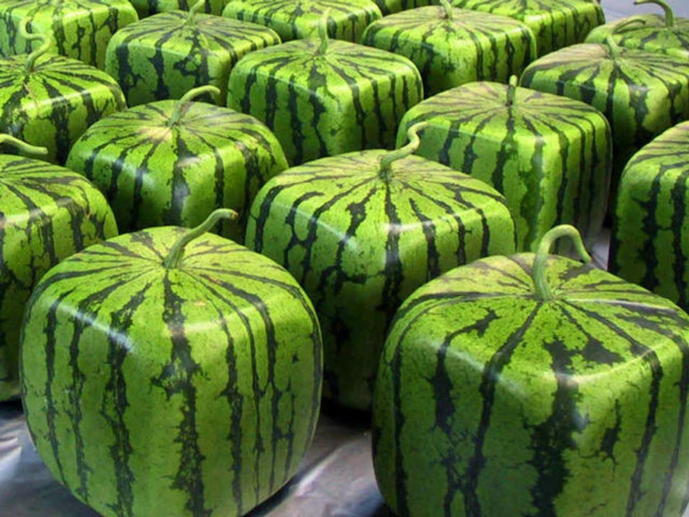
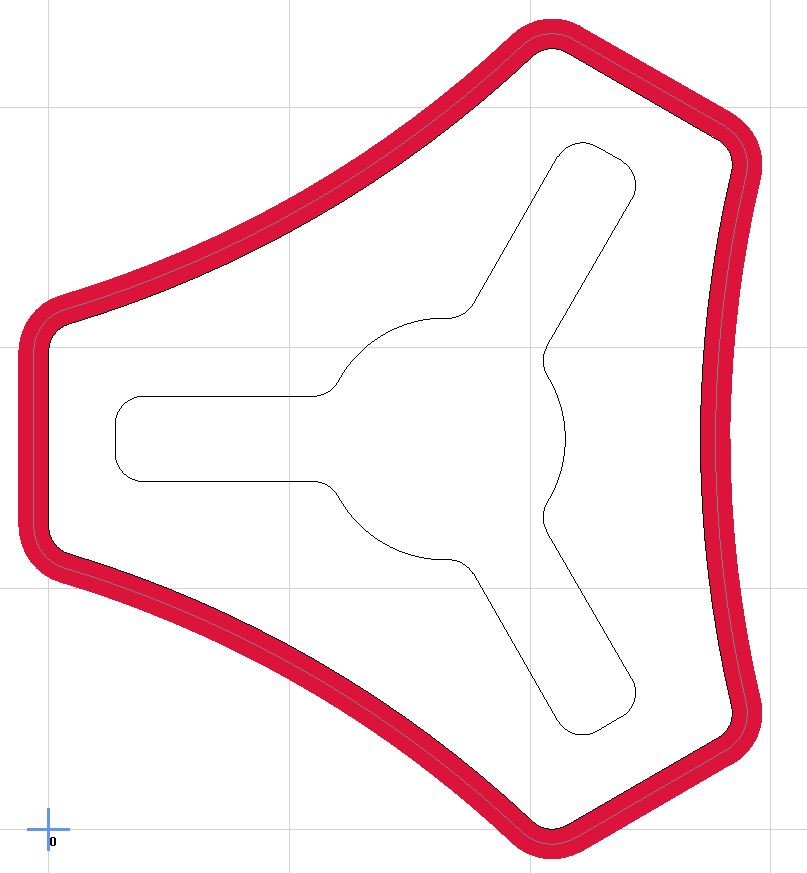

# Auto Square, Dual EndStops

## Basics

The Dual EndStop firmware update enables unprecedented precision more easily than ever before. Since
day one I have not encouraged endstops be used, until now.

{ loading=lazy width="300" align=right }
The Mostly Printed CNC and LowRider CNC are unique compaired to other machines in the fact that two of the axes are powered at
each end. Using this fact and the new dual endstop firmware we can now more precisely
and accurately set the position of every single stepper on the machine independently. This should
reliably give you repeatability on the order of your endstops resolution, even after powering off.

Before this new firmware update all the machines in this category relied 100% on the users build
accuracy, or manual measuring. This involves setting of each axis before engaging the steppers and
locking it in place. If the steppers are ever disengaged during use only the side of the axis with
an endstop can accurately be accounted for. This makes fixturing, tool changes, and multi-day jobs
extremely difficult to get repeatable results. A poor build or lack of axis alignment before each
job would result in a non-square skewed axis. A skewed axis will result in ovals and parallelograms
instead of circles and 90° cornered rectangles. Changes in build accuracy due to use and
environmental conditions need to be adjusted out or accounted for manually. **Now** just a minor offset
adjustment from the control panel will correct this.

Here is a look at the very first test of autosquaring. It is even more accurate now, it will square the axis, then do it again slower to account for any initial endstop offsets due to the skew.
<iframe width="560" height="315" src="https://www.youtube.com/embed/F-tw3WuV8jk"
  title="YouTube video player" frameborder="0" allow="accelerometer; autoplay;
  clipboard-write; encrypted-media; gyroscope; picture-in-picture" allowfullscreen></iframe>
___

## Firmware

The dual endstop firmware is on the V1 Engineering [Marlin Builder page](https://docs.v1engineering.com/electronics/marlin-firmware/)
page.
___

## Use

First, most carving or one tool sign jobs will not benefit from using endstops. Getting the machine close and just running a
quick one off carving or sign has no need to go through all the extra steps. People new to the CNC
world should not use this at first; this is an advanced technique. 

- You can now use the machine in multiple ways. Quick one off jobs as you always would setting the home
position by hand and just running the job. Or by starting each job with a `G28` (if using a touch
plate) you can now reference or return to that position at any time. If you are not using a touch
plate you can use `G28 X Y`

- You can use fixtures at a set reference points on the table to do repeat jobs or multiple sided
cuts utilizing CAM based work offsets or scripts.

- Tool changes can be done with multiple gcodes so you can do repeat jobs in order of bit used
instead of per piece depending on if changing the part of the bit is the faster choice.

- Jobs can be restarted in case of power outage, tool breaks, long multi day jobs, apply paint
between cuts, etc.

- If you don’t need the endstops you can just insert the command, `G92 X0 Y0 Z0`, in your gcode before
the cut starts. This should allow for normal use without homing or work offsets, also no squaring.

For more info please see the [Milling Basics](../tools/milling-basics.md) page.
___

## Endstop Testing 

After all the endstops have been connected issuing a `M119` command, in any terminal window, will 
let you see the current status of each endstop. You should check that each endstop registers both an 
open and closed status before proceeding. Open when not touching and closed when they are. You can test them individually
by closing each one by hand and running an `M119`. Also verify the X1 corresponds to the X1 stepper.

Then verify a positive movement is away from the end stops.

Remember small 1mm moves when initially powering it up, if driving your steppers the wrong way you
can rip your machine apart. If your steppers are moving the wrong direction, **completely power off
your board before flipping the plug over.**

## Calibration

The unfortunately designated `M666` lets you test your offset to quickly calibrate your machine. Using
the command `M666 X0.72` would offset the X1 stepper 0.72mm away from its endstop, Y and Z can also be
used depending on which machine you have. To verify your current settings during calibration just an `M666` will show the current offsets.
Once the correct offset are found you should input them into your firmware and save them with an M500 command.

This is to simplify the actual placement of the endstops themselves, you only need to get them such
that the X1 or Y1 endstop is at or slightly behind where it needs to be within a few Millimeters is
best.

1. You can verify how square your axis is by measuring the diagonals of the largest rectangle you can
   draw in your build area. The larger the more accurate…but also harder to measure. I only have 6″
   calipers but I was more accurate with a tape measure at my 440mm available diagonal.
2. Measure the diagonals to the X1 and Y1 endstops blocks.
3. Offset the endstop that has the short dimension by the amount it is short or just a hair over. So
   if the X1 diagonal was 1mm short you would offset X1 by 1mm. M666 X1. Tip – If it is more than 2mm
   off move the stop block, each belt tooth is 2mm.
4. Draw a fresh one to verify. If that is correct you should edit your firmware to make this change
   permanent in configuration.h Or add it to all of your Gcode.
5. Enjoy!

Care should be taken to use as little pen pressure as possible with the finest tip possible to get
the most accurate results and a pen mount with some give should be used, [example pen
mount](https://www.thingiverse.com/thing:1612207).

My trials and tribulations figuring this out….Feel free to make fun of me. [Forum
link](https://www.v1engineering.com/forum/topic/accuracy-step-1-pen/).
___

## Work offsets

Make sure your job has a work offset if you use the endstops.

A typical part has the gcode built with the origin at the parts corner. If you were to cut out that
part it would result in going negative past your endstops and misalign your machine.

{: loading=lazy width="400"}

Negative moves do not work on the X and Y axis with endstops.

{: loading=lazy width="400"}

Moving the origin in your CAM program is the easiest fix.

To get a more precise work offset it is best to add it in your CAD file. This can be done with a
bounding box, cut it as a separate path and used to position your material.
___
