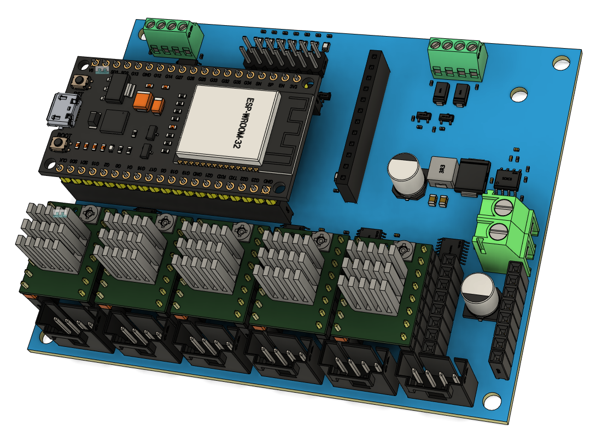
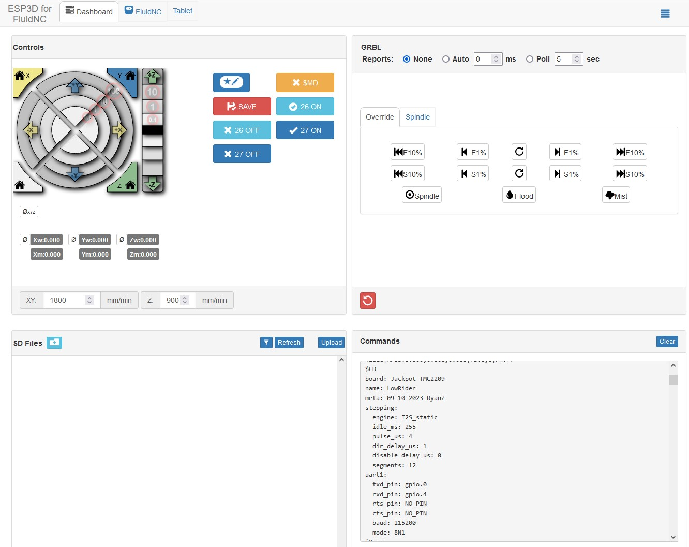
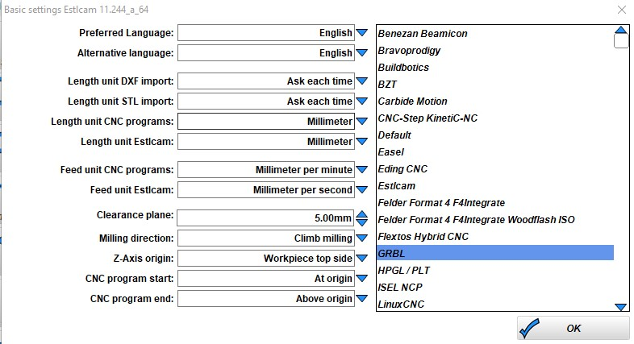
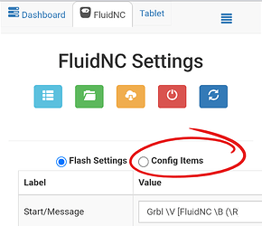
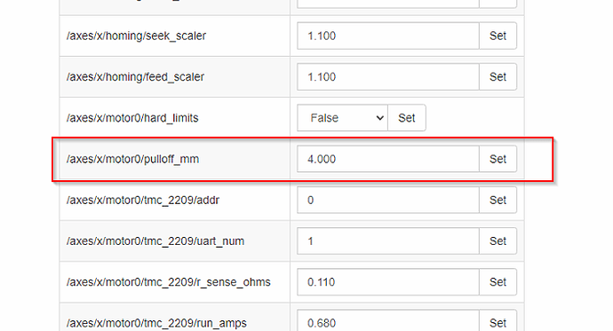

# Jackpot CNC Controller

## Basics

The Jackpot CNC Controller is a 32bit dual-core 240mhz board, WiFi, Bluetooth, or hardwired capable (esp32). It has 6x TMC2209 driver ports, 7 inputs, 2x 5V outputs, 2x input level outputs, one expansion module socket.
MicroSD card slot. The board runs FluidNC which is fully GRBL compatible with extended features and easier configuration.

**Want to buy one?**

[Jackpot CNC Controller is available here in the shop.](https://www.v1e.com/products/jackpot-cnc-controller)

{: width="800"}

### Thanks

First and foremost, thank you, Bart Dring for the amazing design and custom firmware required to make this happen. This is based off the [6 Pack Universal CNC Controller Development Board](https://www.tindie.com/products/33366583/6-pack-universal-cnc-controller/) and changes were made to accommodate all the use cases I have seen with the V1 CNC Machines except for 3D printing. Also, many thanks for GRBL-ESP32 and now [FluidNC](https://github.com/bdring/FluidNC).

Mitch Bradley also deserves a lot of thanks for handling the day to day of FluidNC and providing a ton of chat based support on Discord.

## Specifications

+ ESP32-wroom-32 Based control board
    * 32bit dual-core 240mhz board.
    * WiFi, USB Direct connection, or Bluetooth (rarely used).
    * Onboard or external antenna
    * Micro USB, or USB-C
    * Socket based for easy swapping if anything were to ever go wrong, or you want to quickly change configs.
    * 38 pin - [ESP32-DevKitC CP2102 - MicroUSB](https://amzn.to/4766q7B), These seem to be the most reliable.
    * 25.4mm header width
    
+ 9-24VDC
    * Current required is a minimum of 19W (24Vx0.8A).
    * If you plan on using the high current outputs adjust accordingly.

+ 6x Stepper driver sockets
    * This controller is designed for use with TMC2209 drivers in UART control mode only
    * Typically, TMC2209 drivers are limited to 4 addresses. This controller uses a CS (chip select) pin for 3 of the drivers to allow 6 drivers to be individually controlled.
    * The sockets are labeled XYZABC, but you can use any socket for any axis or motor number. The letters are just for reference only.
    * **No Stallguard**

+ 7x Inputs
    * All switch inputs are active low, the LED goes on when ground is connected to the pin.
    * They have a 10k pullup external to the ESP32. The signal pin (S) should be connected to the ground pin (G) to activate the switch. 
    * The 5V Rail is optional and is used for external switches that require 5V. 
    * Define the pins in the config file to NO or NC like this...
    * Define an N.O. switch like this. gpio.xx.low
    * Define an N.C. switch like this. gpio.xx

+ 2x Line level outputs (same as input voltage)
    * PWM Capable
    * The MOSFETs switch to ground. You can use any voltage up to the VMot max as the positive, as long as it uses the same ground reference.
    * Can be used to drive 2.5A continuously before they overheat. You can use them intermittently up to 3.5A. If using above 2.5A you should test to see if they start to overheat.
    * They can be used with inductive loads (solenoids, relays, DC fans/motors)

+ 2x 5V outputs
    * PWM Capable
    * These will source and sink about 25mA each.
    * Most commonly used for tool SSR's and Lasers.
    * See the "Spindle" section of the FluidNC wiki for common uses.

+ 1x Expansion Module socket
    * [6 PACK expansion module source](https://oshwlab.com/bdring?tab=project&page=1)
    * [Buy Them](https://www.tindie.com/stores/33366583/)
    * This should be able to use any CNC I/O module. Use an 11mm standoff or a 3D printed support in the mounting hole provided.
    * These Modules can be just about anything you need, more inputs, outputs, relays, spindle, VFD, Servo, OLED...

+ 1x MicroSD card slot
    * larger than 2gb needed
    * Fat32
    * 30 character or less file names, 100 character or less file location

+ Firmware
    * [FluidNC](https://github.com/bdring/FluidNC)
    * Text based config file for simple firmware edits.
    * No compiling to flash a board or change the configuration.
    * ~100% GRBL compatible
    * Custom ESP3D-UI which includes a tablet mode with Gcode viewer.
    

+ Dimensions
    * 80mmx100mm Board footprint
    * [CAD/Step link](https://a360.co/3KchBBL)
    * [Dimensions](../img/jackpot/Jackpot_2023-07-08 Drawing.pdf)
{: loading=lazy width="400"}
    * ISO
{: loading=lazy width="400"}

## Controls

The Jackpot Control board can use most any control software that supports GRBL. Most people will likely use the built in WebUI. This can be used from any device that has a web browser. If you are using a small touchscreen you can even zoom in so the buttons are easier to hit.

{: loading=lazy width="400"}

This Interface is a slightly modified version of the [ESP3D WebUI project](https://github.com/luc-github/ESP3D-WEBUI). This interface allows for wireless machine jogging, custom macros, quick buttons for most of the Jackpot’s outputs, terminal control, file system control, UI and board configs, all in one place. You can update the firmware, GUI, and board settings all from the WebUI.You can wirelessly transfer your gcode files, but manually using the MicorSD card is still preferred. Most will probably never even plug the USB port in.


## Initial Setup

If you bought it from the V1E.com store it should be ready to go. You should be able to log in directly to SSID=FluidNC PASS=12345678 (some browswer will then need to be pointed to 192.168.0.1, best to bookmark that address). From there you can control your machine, upload files, change settings, even update the firmware or GUI all OTA.

We use the Jackpot board in AP mode (access point), this is a direct connection betwean your web enabled device and the board itself. If you have a touch screen device that should function as well as zoom if you need it for big fingers. Of course keyboard and mouse will work just as well.

!!! Note
    You can also configure your device in STA mode. This will get your board connected to your local network. This is advanced and not reccomended unless you are very confident in your networking setup. If you choose to do this [disabling SSDP](http://wiki.fluidnc.com/en/features/wifi_bt#wifi-settings) is reccomended to save memory. The FluidNC wiki does currently say STA mode is reccomended but do to network differences it is not reccomended here as it is impossible to support and troubleshoot, also the reason for this reccomendation might be outdated.

#### Wiring

The steppers and endstops plug in in this order from left to right

Click on the image to enlarge.

{: width="400"}

MPCNC = X, Y, Z, X2(A), Y2(B)

{: width="400"}

LR = X, Y, Z, Y2(A), Z2(B)

The touchplate plugs into the last port (gpio.36), on both boards.

#### Test endstops led/terminal

The onboard LED's test the wiring connections. Our Normally Closed (NC) endstop wiring, our CNC standard, will have a lit LED when not triggered and not lit when triggered. The Probe is the opposite, lit when triggered.

You can test the firmware by running "$Limits", this will show a real time trigger display. "!" to exit that mode.

## Common Commands

**$H** - Equivalent to Marlin's "Home All" or G28. $HX, $HY, $HZ for individual axes.

**$MD** - Disables the steppers, power them down.

**~** - Resume from a Pause (M0), feedhold, or safety trigger. Can be a input button, "cycle_start_pin:".

**$CD=config.yaml** - saves any config changes you make to the file. To allow it to be there after a reboot.

**$S** - This shows all the values, the config file does not contain them all only changes from default.

## Setting up Estlcam

This section is for setting up estlcam for GRBL/FluiNC

{: loading=lazy width="400"}

Change the basic settings to GRBL.

[Config file](../img/jackpot/FluidNC.pp), to install this file open EstlCAM, setup, CNC Programs, open settings at the bottom. This will import all the settings, feedrates, rapids, starting gcode, toolchange, and ending gcode sections. Everything in one file and it is ready to use. Below are the details of this file.

Some screen shots needed here.

Starting Gcode-
```markdown
G21
G90
G94
G92 X0 Y0
M0 (MSG Attach probe)
G38.2 Z-80 F200 P0.5 (probe down set thickness )
G1 Z10 F900
M0 (MSG Remove probe)
M62 P1 (If used start spindle pin27 )
```

Tool Change-
```markdown
M63 P1 ( turn off pin 27)
$HZ (Home Z)
G0 X0 Y10 F2520 
M0 (MSG change tool, probe)
G38.2 Z-80 F200 P0.5 ( Probe set thickness)
G00 Z10.0000 F500 ( Clearance )
M0 (MSG remove probe)
M62 P1 ( turn on pin27 )
```

Ending Gcode-
```markdown
M63 P1 ( stop spindle pin27 )
$HZ
M30
```

## Auto Square

Auto Square on this board no longer uses Gcode commands. You can edit each endstop indivdually directly from the "Config" section of the WebUI (or directly to the yaml file).

{: loading=lazy width="400"}

From there you have a "pulloff_mm" setting for each endstop. This setting is how far the machine backs away from the endstop after it triggers it. This needs to be far enough to reset the trigger at a minimum and if your values should be within 3mm of each other. If they are not it is best to move the endstop triggers.

{: loading=lazy width="400"}

Be sure to **save** your edits by using the red save button on the homescreen!

## Laser tips

For the fastest raster etching, the most reasource intensive thing we can do. Either use AP mode with a microSD card, or turn off the wifi and use only the USB (with [Lightburn](https://lightburnsoftware.com/)).

**$Wifi/Mode=off** - if you are using the USB connection to Lightburn to use some of the built-in tools use this command to turn off the radio. It will come back after a power cycle. 

If you have a laser defined in the config you are always in "laser" mode (M4). So you can either leave it defined and use M5 (turn off laser mode) in your starting gcode for non-laser CNC use, or just comment out the laser in the config (like I ship it). The Jackpot can have multiple config files stored on it.

Raster speed depends on dot size, for a 0.19mm resolution I am getting 70-120mm/s depending on the type of raster.

### Laser Config.yaml Edits

Replace the following section in your yaml file. Change any settings you need to this scales the output from 1-1000.

```markdown
user_outputs:
  analog0_pin: NO_PIN
  analog1_pin: NO_PIN
  analog2_pin: NO_PIN
  analog3_pin: NO_PIN
  analog0_hz: 5000
  analog1_hz: 5000
  analog2_hz: 5000
  analog3_hz: 5000
  digital0_pin: gpio.26
  digital1_pin: NO_PIN
  digital2_pin: NO_PIN
  digital3_pin: NO_PIN

Laser:
  pwm_hz: 5000
  output_pin: gpio.27
  enable_pin: NO_PIN
  disable_with_s0: false
  s0_with_disable: true
  tool_num: 0
  speed_map: 0=0.000% 1000=100.000%
  off_on_alarm: true
```
Quick note, **gpio.26** can have a quick pulse when starting. If you are using a 5V pin for your laser pin 27 is the better option for your enable pin.

## Firmware
If you bought it from the V1E.com store it should be ready to go. This is in case you want to update or start fresh.

Keep an eye on this page or you can even subscribe to updates to know anytime the configuration files have changed, [Config and macros are here](https://github.com/V1EngineeringInc/FluidNC_Configs).

Some PC's will need USB drivers, if needed the ESP32 USB drivers are here [CP2012 drivers](https://www.silabs.com/developers/usb-to-uart-bridge-vcp-drivers?tab=downloads).

There is no need for compiling or any of the previous steps needed to "flash" a marlin based board. There are three options for doing this.

**Preferred - Browser Based** - There is a [browser based tool by Joacim](https://breiler.github.io/fluid-installer/) (works best in Chrome). From here you need to connect your esp32 to your computer. Select connect, and follow the prompts. It is best to always start fresh.

After you have loaded the firmware you can restart and use the file browser to load our configs and macros from here, [Config and macros are here](https://github.com/V1EngineeringInc/FluidNC_Configs).

!!! Note
    Some ESP32 boards require you to hold the boot button to start flashing them, then you can release it when it starts. This is the button closest to pin D0. The Web installer will prompt you if this is needed, manual metheds will not.

**Manually** -
[Firmware files are here](https://github.com/bdring/FluidNC/releases) 
[Config and macros are here](https://github.com/V1EngineeringInc/FluidNC_Configs)

Detailed instructions [FluidNC WIKI Install](http://wiki.fluidnc.com/en/installation#using-pre-compiled-files)

When you download the files you can unzip the folder and run erase.bat (unless you are purposely updating only one part), install-wifi.bat, then install-fs.bat. Run FluidTerm from that same folder and hit ctrl+u to select the config.yaml for your machine (linked above), hit enter to accept the name. After that is done uploading, you can hit ctrl+r to reset. The Fluid term is a crazy good tool If you ever have any issues, this is how we will check it. When you are all wired and powered up, I suggest using it to reset the board and check to see everything is working.

You can also load the preferences.json, and macrocfg.json files using CTRL+U. After you log in you can more quickly load the "macro**.g" files

**Compile from source** - You can also download the source files and compile and flash it directly from something like platform.io.

### Updating

If you ever want or need to update the actual firmware, GUI, or configs you can do it with the [browser based tool by Joacim](https://breiler.github.io/fluid-installer/), OTA in the WIFI GUI, [FluidNC Wiki - Update](http://wiki.fluidnc.com/en/installation#upgrading-firmware), or manually with FluidTerm,[browser based tool by Joacim](https://breiler.github.io/fluid-installer/). This is very easy, no compiling. 

The GUI update file is, "index.html.gz", and found in the wifi folder [here](https://github.com/bdring/FluidNC/releases). To update this just overwrite the current file and reboot.

Config files are config.yaml (the name can be changed). To update this just overwrite the current file and reboot.

The Firmware bin update is automated using the web tool, ran from the OTA section of the GUI, or run install-wifi.bat manually.


### Configuration Files

[Github link](https://github.com/V1EngineeringInc/FluidNC_Configs) 
You can sign up for notifications of any updates if you would like.


## Input / Output / Module port

**gpio.26** can have a quick pulse when starting. If you are using a 5V pin for your laser pin 27 is the better option for your enable pin.

If you use a module that needs UART you will need to add;

```markdown
uart2:
  txd_pin: gpio.14
  rxd_pin: gpio.15
  rts_pin: gpio.13
  baud: 9600
  mode: 8N1
```

### FluidNC Details

The [FluidNC Wiki](http://wiki.fluidnc.com/) has all the details of this firmware, with an excellent search bar. If you still get stuck you can of course turn to the [V1E.com forum](https://forum.v1e.com/) or there are links to a FluidNC specific discord in the wiki.

## Cases

[Printables collection link](https://www.printables.com/@V1Engineering/collections/815309).

If you have a case that is not part of this collection please let me know and I will add it.


## Troubleshooting
Some issues we have seen.

-No connection - Charge only USB cable, make sure yours is data capable.

-No memory card showing up - Try a [class 6 card](https://amzn.to/3t4lVgF), or slower formatted in fat32. New fancy high speed cards are hit or miss. [A1 rated cards](https://amzn.to/3PRpYpx) seem particularly troublesome.


## Changelog

V1 - 8/10/23 - Just a graphics change from RC2.

RC2- 
:   Power and output headers, smaller holes for cleaner assembly
:   Logo change on the back
:   Stepper header label change

RC1- 
:   Initial release

## License and Source

This project is released under the [GPLv3 license](https://www.gnu.org/licenses/gpl-3.0.en.html)

[V1 Source](https://oshwlab.com/allted/4layer-desktop-rc1_copy)
