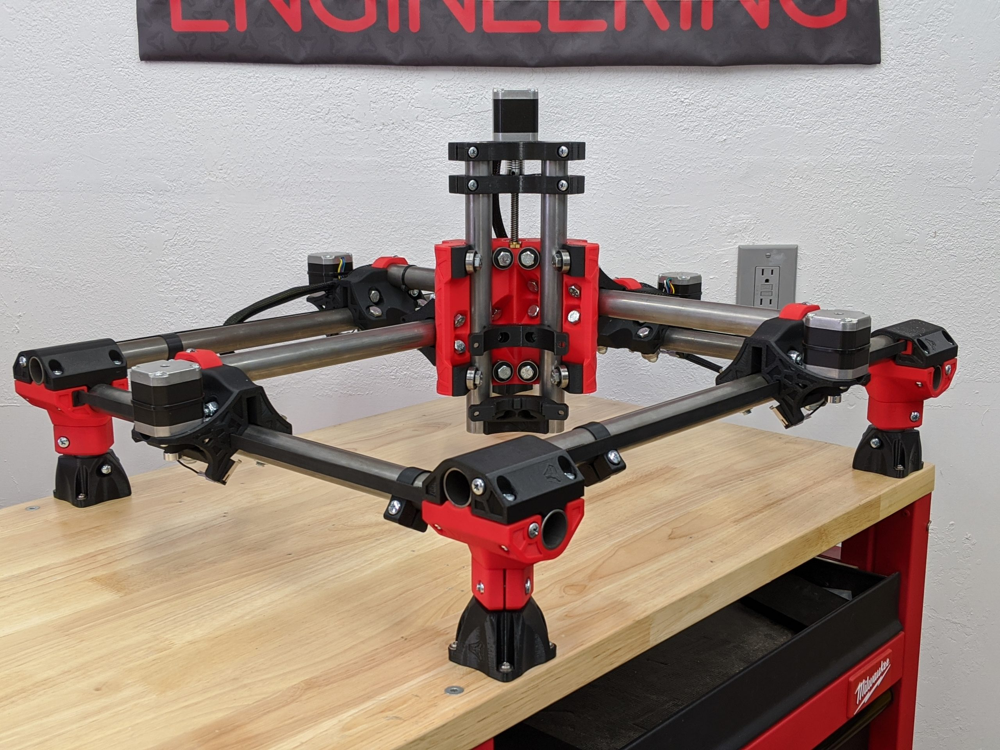
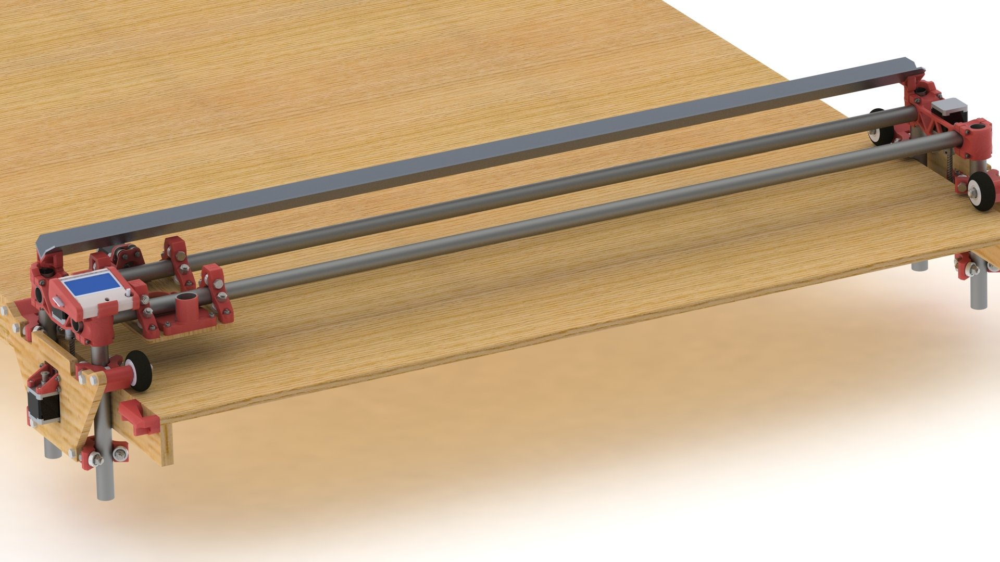
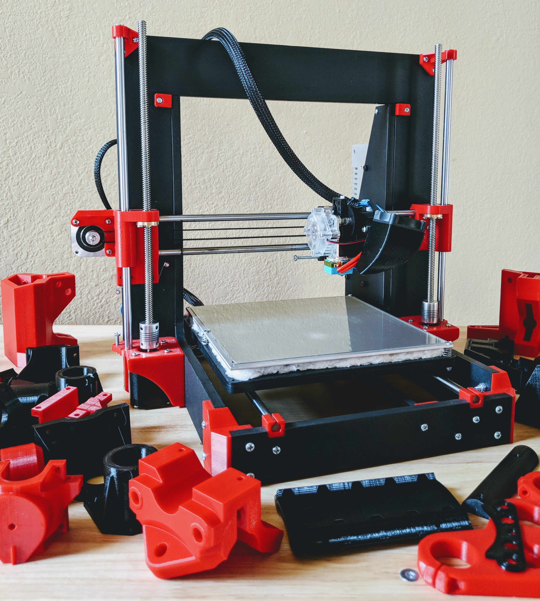
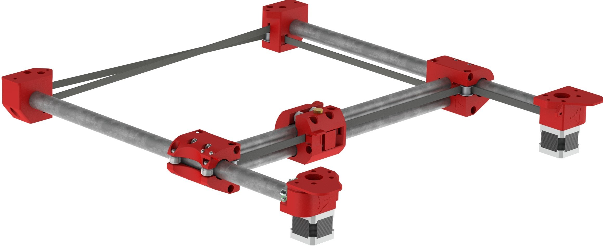

# Marlin Firmware

This is where you can download the latest configured Marlin Firmware for your V1Engineering machines.
Release notes and details are [in github](https://github.com/V1EngineeringInc/MarlinBuilder/releases)

After downloading the right firmware below, you can flash it to your controller ([Rambo, Mini-Rambo,
Ramps](xloader.md), or [Skr](skrpro.md#firmware)). Or compile and flash using
[platformio](../learn/platformio.md) or [arduino](arduino.md).

## Levels of Testing

Not all of these configurations go through the same rigor before being released. There are just too
many to test, but that doesn't mean we shouldn't share what *should* work. These levels give you a
rough idea of which configurations have the most users and the most testing.

### V1Engineering Tested Configurations

!!! success "Officially Tested Firmware Configurations"
    These options are tested at V1Engineering.

### Community Tested Configurations

!!! note "Community Tested Firmware Configurations"
    These options are not tested at V1Engineering, but community members in the
    [forums](https://forums.v1engineering.com) have tested them and report that they work.

### Untested Configurations

!!! warning "Not Tested Firmware Configurations"
    These options are not tested. Let us know if they work for you in the [forums](https://forums.v1engineering.com).

    Use at your own risk.

## V1CNC (MPCNC or Low Rider CNC) Configurations

{: loading=lazy width="450"}

{: loading=lazy width="450"}

### Ultimachine

### Skr Pro Configurations

### Other Configurations

## MP3DP (3D Printer, not MPCNC) Configurations

{: loading=lazy width="450"}

### Ultimachine

### Skr Pro Configurations

### Other Configurations

## ZenXY Configurations

{: loading=lazy width="450"}

### Ultimachine

### Skr Pro Configurations

### Other Configurations

## Decoding the Config Names

### Machine Type

V1CNC
:   These are created for the CNC machines designed at V1Engineering. This includes the
[MPCNC](../mpcnc/intro.md) and the [Low Rider CNC](../lowrider/index.md).

V13DP
:   V1 3D Printer. This is for the [MP3DP](../mp3dp/index.md).

V1ZXY
:   V1 Zen XY Sand Machine. This is for the [ZenXY](../zenxy/index.md), a corexy machine for 2D drawings in the sand.

### Board Type

Rambo
:   The [Ultimachine Rambo](ultimachine.md#rambo-13-14) board. For purchase in the [Shop](https://www.v1e.com/collections/parts/products/rambo-v1-3l).

Mini-Rambo
:   The [Ultimachine Mini-Rambo](ultimachine.md#mini-rambo) board.

Archim1, Archim2
:   The [Ultimachine Archim 1 or Archim 2](ultimachine.md#archim).

SkrPro
:   The [BigTreeTech Skr Pro v1.2](skrpro.md) (or v1.1), with 6 drivers. For purchase in the
[Shop](https://www.v1e.com/collections/parts/products/skr-pro1-2-6x-2209-drivers-tft35-e3-v3)
This does not work for the Skr Turbo, Skr mini, or the Skr 1.3/1.4 (without the pro, turbo, or mini
name).

Skr1p3
:   The BigTreeTech Skr v1.3 or Skr v1.4. These boards are smaller than the Skr Pro, and has 5 drivers, not 6.

SkrTurbo
:   The BigTreeTech Skr Turbo v1.4.

Ramps
:   The good old [Ramps](ramps.md) board.

### Dual or Series stepper wiring

Serial
:   Any of the V1CNC configs that don't have `Dual` or `DualLR` in the name are configured for
serial wiring (which works on the MPCNC and the Low Rider). Check out [more information about series stepper wiring](steppers.md)

Dual
:   This indicates a configuration for a Dual Endstop MPCNC. Check out [more information about dual
endstops](dual-endstops.md)

DualLR
:   This indicates a configuration for a Dual Endstop Low Rider. Check out [more information about
dual endstops for Low Rider](dual-lr.md)

### Driver Type

Some boards support more than one kind of driver. These codes indicate which drivers you install into the driver sockets.

8825
:   DRV8825. Made famous by pololu. The a4498 or any 8825 compatible driver (like a TMC driver in
standalone mode) would use this type.

2209
:   TMC2209. These are for the Trinamic TMC 2209 drivers. If you are using another TMC driver in SPI
or UART mode, then you will start with this, and change the driver type.

## Alternatives

Depending on what type of control board you use you might have other firmware options. Many firmware
versions are fairly board specific though. There could be a long list here, instead may we suggest
having a look in the forums to see what others have tried out and if it might be a better option for
your specific use case.

