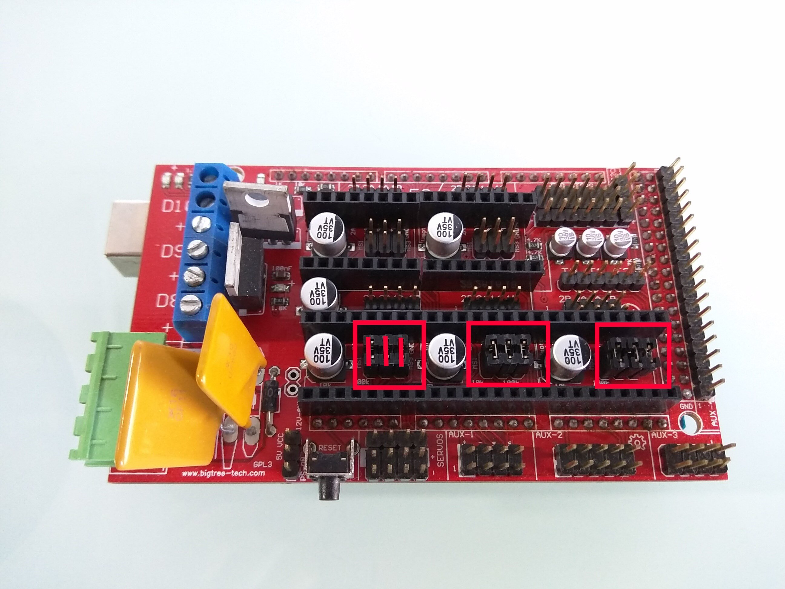
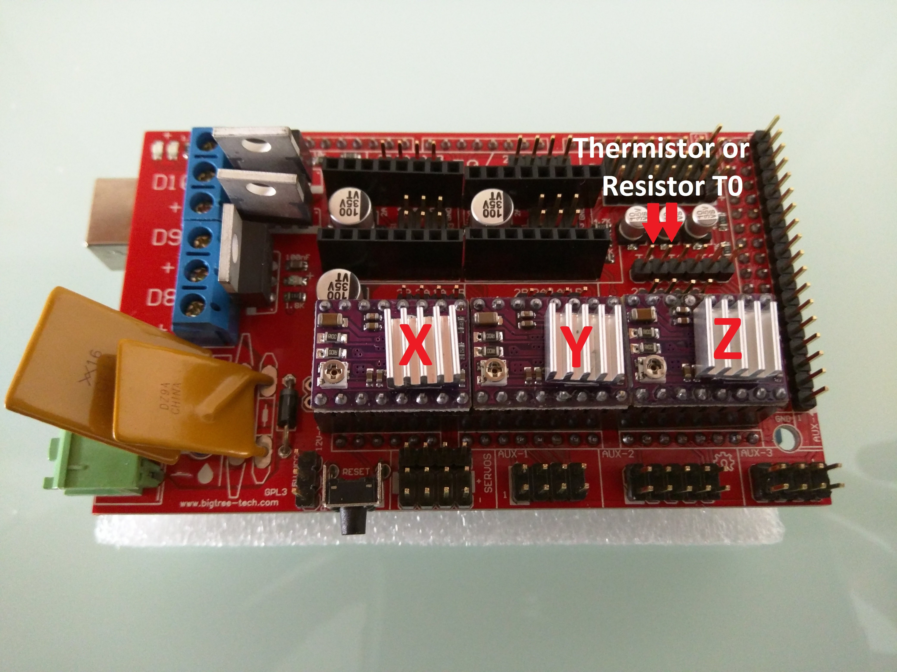
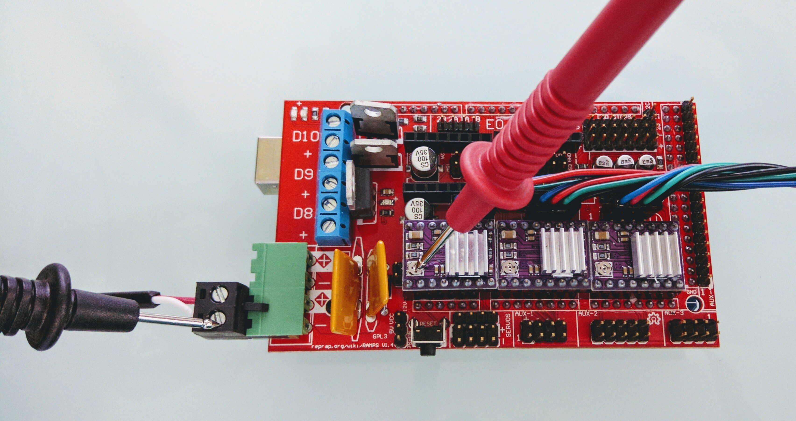
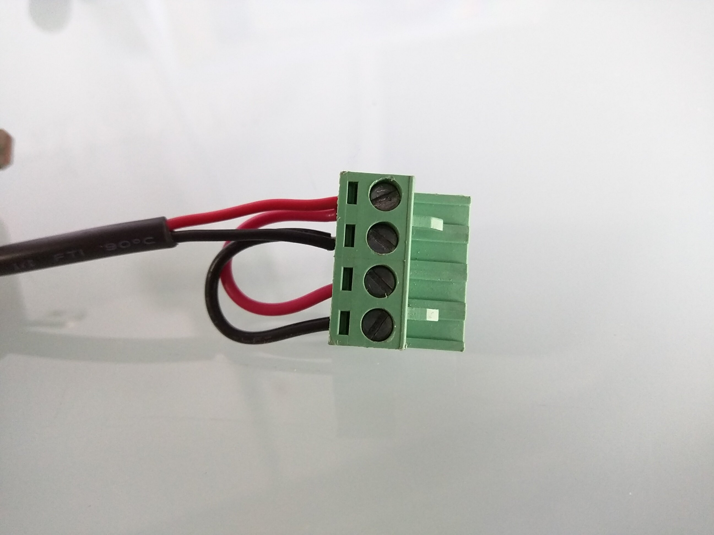

Click on the images to embiggen.

# Ramps 1.4 Stack
If you bought this from V1 Engineering then this has already been done for you just plug in the steppers and go.
Ramps 1.4 – Any control board can be used to control the Mostly Printed CNC, Here is how to set up a ramps stack.
[Mac user?](https://www.v1engineering.com/forum/topic/cannot-connect-to-rampsarduino-maclinuxwindows/#post-11485)

{: loading=lazy width="400"}

## Jumpers
 First step is making sure you have 3 jumpers under each stepper driver. This puts the ramps board into 32nd stepping when using the DRV8825 drivers (if you use a different driver pay attention to its orientation and step rate).

{: loading=lazy width="400"}

## Drivers
 Insert the drv8825 drivers into the board, with the small silver potentiometers facing the green power plug. Glue on the small heat sinks on to the large chips. T0 is for a thermistor, or if you are only milling the firmware does not require a resistor anymore.

{: loading=lazy width="400"}

## Power 
Add 12V to the power port and plug in the steppers. The Arduino barrel jack (the round plug) is not used.

{: loading=lazy width="400"} 

## Stepper Driver Current 
–Extremely Important– Adjust the potentiometers according to your stepper spec sheet (a good place to start is 0.7V or less).  For the DRV8825 the voltage is set between the potentiometers and the power ground.  Voltage at the pot =.9*(stepper current/2) the 90% is to cut down on the heat a bit. This needs to be done while the drivers are energized. The easiest way I have found is to move all 3 axis 1mm in repetier host and leave it connected while you adjust the POTS.

This [pololu video](https://youtu.be/89BHS9hfSUk) gives a very technical walk through on driver current.

<iframe width="560" height="315" src="https://www.youtube.com/embed/89BHS9hfSUk"
  title="YouTube video player" frameborder="0" allow="accelerometer; autoplay;
  clipboard-write; encrypted-media; gyroscope; picture-in-picture" allowfullscreen></iframe>

## Firmware 
Have you flashed the marlin [firmware](marlin-firmware.md)?

## Common Issue
[Steppers moving the wrong direction?](../software/reverse-motor.md)

## Add an Extruder
If you are Adding an extruder you need more power

[For example](../tools/import-extruder.md).

{: loading=lazy width="400"}

Power is needed to both sides of the power plug, either by a short jumper wire or another power supply depending on how much current you can supply. In this picture the bottom set, 5A, powers the board and steppers. The top set, 11A, handles the heaters, fans in the d8-10 ports.

{: loading=lazy width="400"}

Plug in the extra driver for the extruder with its jumpers under it, and the extruder stepper. The blue and black is the hot end thermistor. Blue and white is the print fan, controlled by your GCode, polarity sensitive, D9. Orange and white is the extruder heater, D10. There is also an extra set of red and black wired to the power plug that controls the always on extruder fan, polarity sensitive.
