# SKR Pro V1.1 & V1.2

## Basics

The SKR Pro is a 32bit 6 driver board with 6 easily controllable ports running at 12-24V. Beyond the
basics there are loads of extra pins, options for two different power supplies at two different
voltages, WiFi Ports, future expansion port for USB, and the Trinamic TMC drivers with digital current control.

**Want to Buy one?**

[SKR Pro Bundle is available here in the shop.](https://www.v1e.com/collections/parts/products/skr-pro1-2-6x-2209-drivers-tft35-e3-v3)

There are many options involved here. To offer the best experience for most users I have settled
on the TMC2209 drivers, and the TFT35 V3 E3 screen.

{: loading=lazy width="400"}

!!! 2209 Drivers
    The Trinamic 2209 V1.2 drivers offer UART communication for dynamic control, 2A RMS with a 2.8A
    peak. We will be operating far under these values. The Trinamic drivers have many advanced features.
    For a CNC Machine, the main features we use are digital current control and dynamically lowering the
    hold current so we can also keep stepper and driver heat down while operating at slightly higher
    than usual stepper power!

## Setup

### Disable Sensorless Pin

Sensorless homing is not as accurate as mechanical end stops. All the pre-compiled
firmware has this disabled so you will need to bend the pins out of the way.

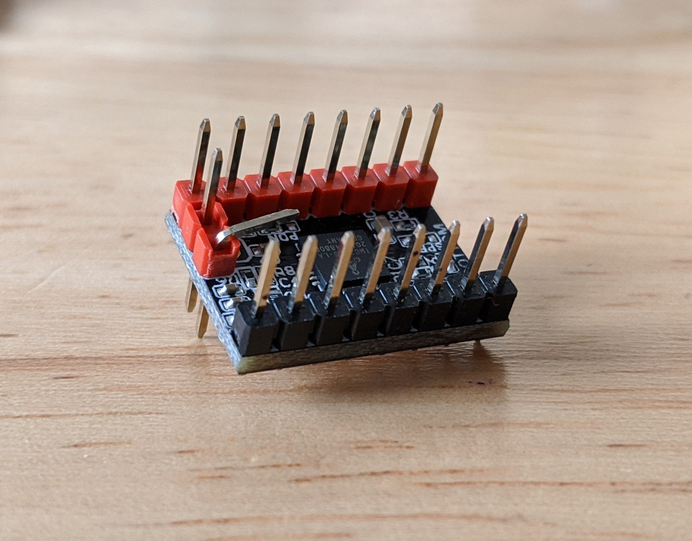{: loading=lazy width="400"}

Bend this pin on each driver to allow mechanical switches to be used on the SKR board.

### Jumpers

For the firmware to be able to control the current and receive feedback from each driver the board
needs to be set for UART communication. To do this you remove the 4 jumpers from each port and place
one jumper on the black (UART) pins. **There is no need to monkey with the tiny potentiometers!**

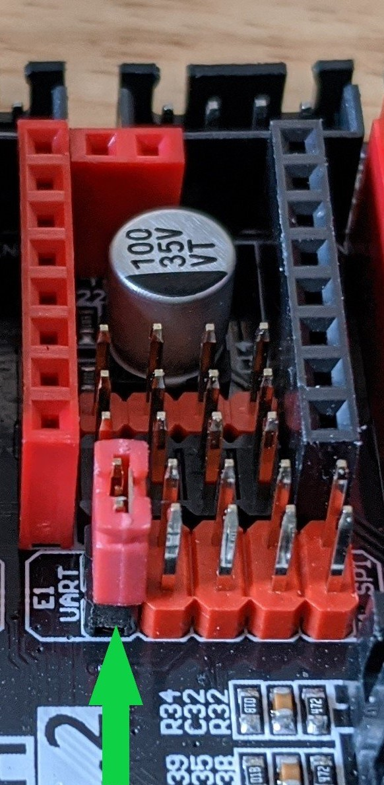{: loading=lazy width="400"}

The completed board looks like this. Notice there are no jumpers under the drivers. **Lowrider and MPCNC builds will have only 5 drivers**, MP3DP uses 6.

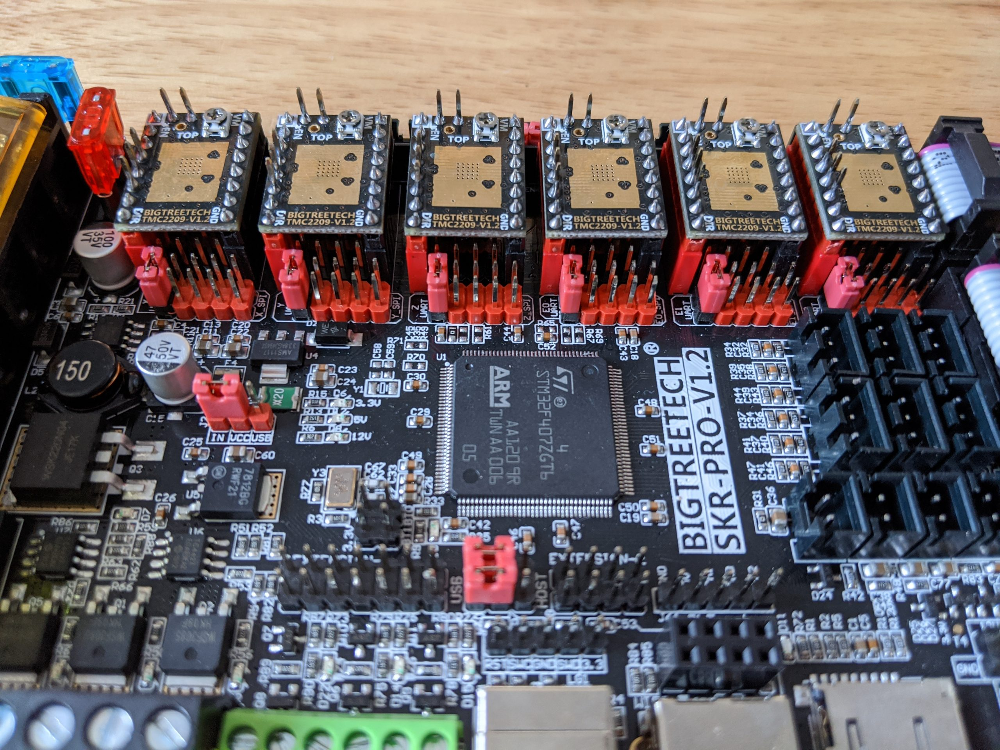{: loading=lazy width="400"}

At this point you can add the heat sinks being careful not to short any of the pins and only stick
them to the copper pads centered on the top.

## Molex and JST connectors

The current V1 Engineering wiring kits have the Molex style terminations on them. The SKR Pro is the first board to be offered with JST directional style connections. To keep the stepper direction easy to change a pretty easy solution is just pulling off the JST plastic shields. The pin spacing is the same and pulling the shields off make for a more solid connection to the Molex style wires we used. Needle nosed pliers and a little wiggling make this pretty easy. 

Depending on what wires you are plugging in you can take them off the end stops and stepper ports. Even after doing this you should always constrain your wires directly after the connection to the board to prevent them from wiggling loose.

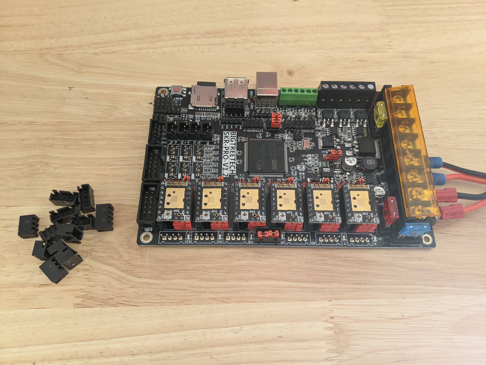{: loading=lazy width="400"}

## Wiring Steppers

We have a few options for how the steppers get connected to this board. Here are the three most
common ways we might use it.

### MPCNC and LowRider CNC

**MPCNC**

| Board Label | Stepper Wire |
|-------------|:-------------|
| X           |     X1 |
| Y           | Y1 |
| Z0          | Z |
| Z1          | Jumpers stay in place |
| E0          | X2 |
| E1          | Y2 |

**LowRider CNC**

| Board Label | Stepper Wire |
|-------------|:-------------|
| X   | X |
| Y   | Y1 |
| Z0  | Z1 |
| Z1  | Jumpers stay in place |
| E0  | Y2 |
| E1  | Z2 |

{: loading=lazy width="400"}

### Reversing a stepper

If your stepper is moving the wrong way you can power down, unplug the power, and flip the stepper plug over to change the
direction of rotation. 

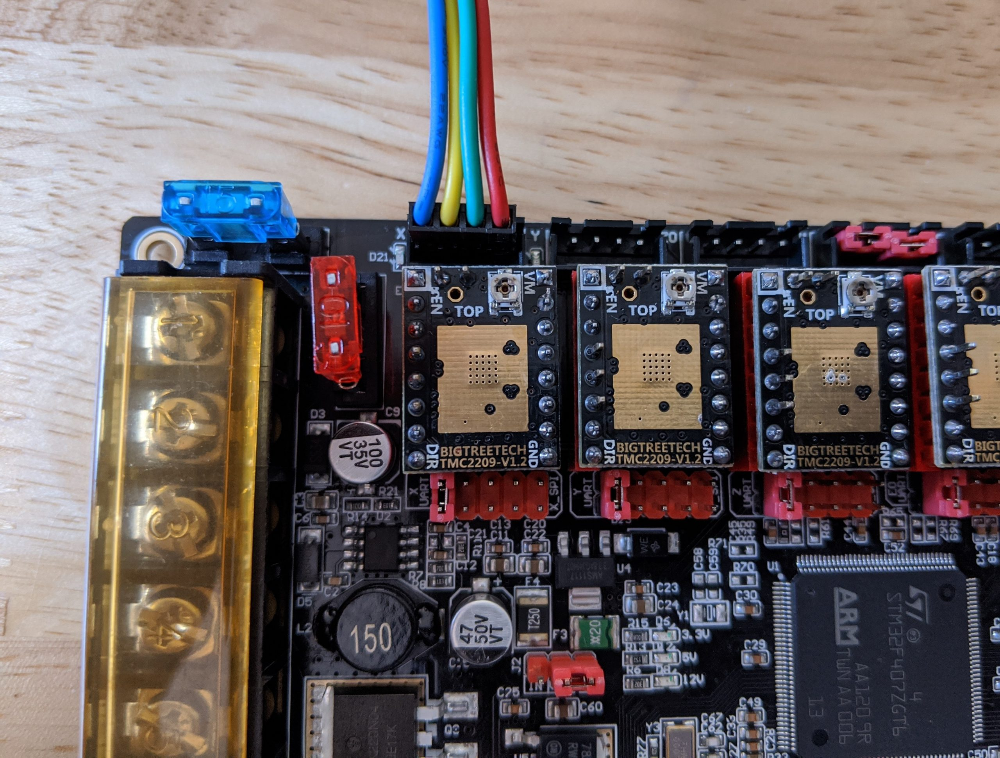{: loading=lazy width="400"}
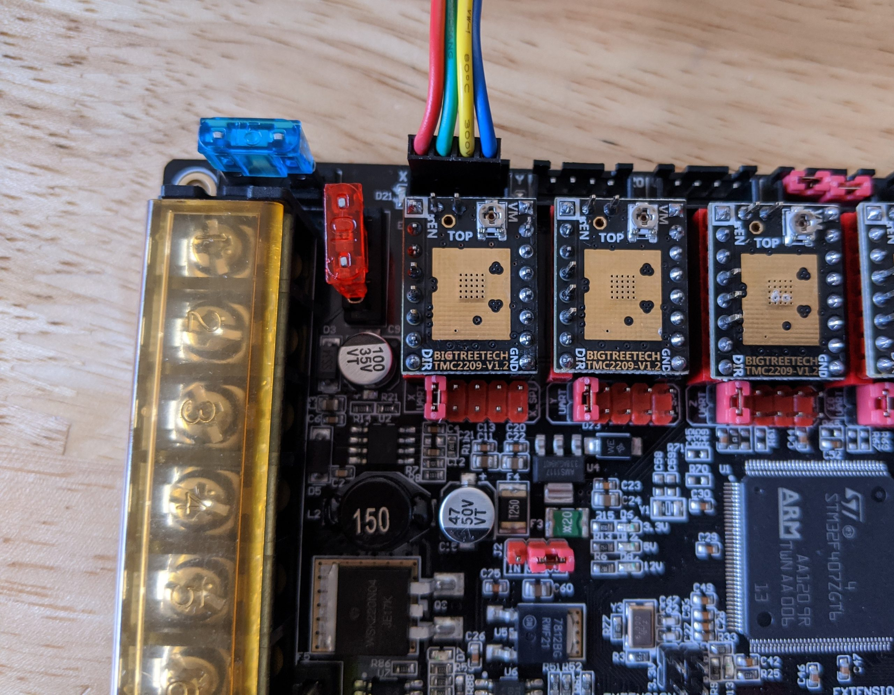{: loading=lazy width="400"}

## Screen TFT35 V3 E3

We can use it from both
Touchscreen mode and Classic mode, simultaneously. **Switching between modes is as easy as pressing
the knob in for 3 seconds.**

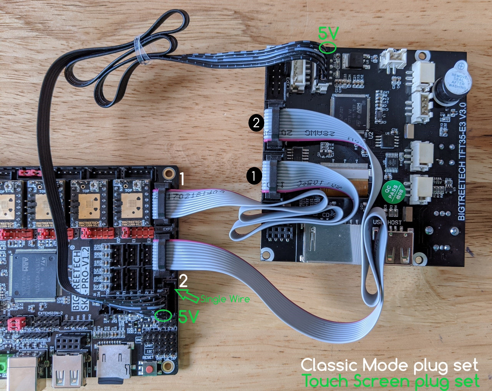{: loading=lazy width="400"}

You do not need to use both; pay attention to the direction the wires are facing when connecting
them.

## Touch plate

All the V1 firmware is ready for a touch plate. Easy as plugging into the Z min port. Use Ground "G" and Signal  "S" pins, they are labeled on the back of the board.

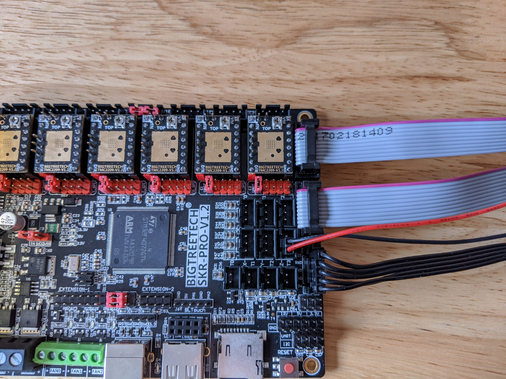{: loading=lazy width="400"}

## Dual End Stops, End Stops

If you are running the Current firmware you will need to have your endstops wired in Normally
Closed (NC), this is the outer two tabs on the endstops, we do not use the middle one. You will plug into the Signal and Ground pins, **Do not use the + pins.** Use Ground "G" and Signal  "S" pins, they are labeled on the back of the board.

Optical endstops are not recommended on a machine used for milling or routing. The debris can inhibit there function.

### MPCNC Dual Endstops
{: loading=lazy width="400"}

### LowRider Dual endstops
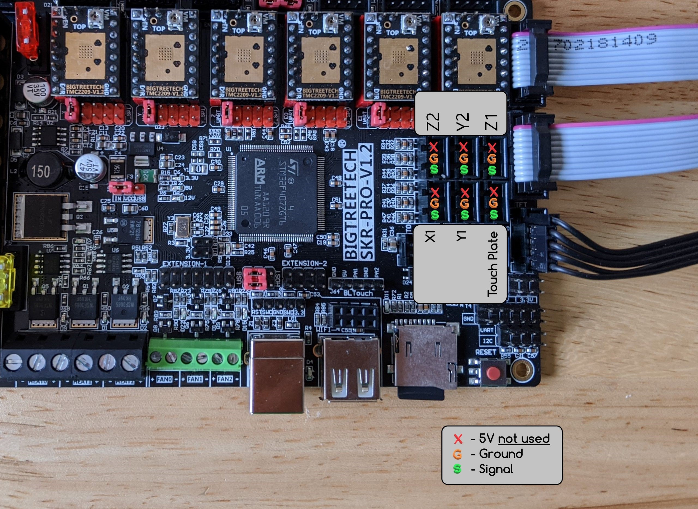{: loading=lazy width="400"}

!!! note
    Do not use the + (positive) pins or you will ruin your SKR Pro board. Unless you are running a different project with powered endstops.

## Firmware

The SKR Pro and TFT screen both can use a bin file to re-flash the firmware. This is as simple as
placing some files directly on the memory card and rebooting them. The boards come already flashed from the store. This would only be used if you want to update.

### SKR Bin

You have options of firmware for the exact board, driver, screen package as sold in the V1 store.

* V1CNC_SkrPro_Dual_2209-****** Ready for dual end stops on an MPCNC (X & Y axes).
* V1CNC_SkrPro_DualLR_2209-****** Ready for dual end stops on a LowRider CNC (Y & Z axes).
* * V1CNC_SkrPro_2209-****** Ready for series wiring on any CNC build.

When you unzip the file you have a .bin file. Rename to FIRMWARE.bin and save it to the MicroSD for the SKR Pro board. Make sure to unplug both grey exp1/2 cables for the screen before proceeding. With the power off, insert the MicroSD into the control board, power on, and the board will flash a few green LED's for a few seconds. The board now has new firmware (seriously that easy). 

**Remove the Micro SD card, after flashing**

!!! note
    Do not use a SKR Pro based machine with the microSD card in the SKR Pro board unless you are using the headless module. This seems to cause random performance issues otherwise.

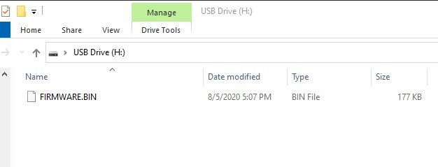{: loading=lazy width="400"}

The file will change extensions when a successful flash happens.

Current release bin files, [V1 Engineering pre-configured firmware](https://github.com/V1EngineeringInc/MarlinBuilder/releases).

You also have the option to get the full Marlin source and edit and compile yourself using [Platformio Docs](../learn/platformio.md).

### TFT Files

Flashing the screen takes a .bin file, the config file, and usually the TFT35 folder (unzipped) on the root of the screens SD card.

BIGTREE_TFT35_V3.0_E3.****.bin
config.ini
TFT35 (folder)

{: loading=lazy width="400"}

Now reset the screen (or board) and watch the screen update itself. You can double check and the files will have a new extension after a successful flash.

The V1 Engineering CNC version of the TFT firmware is on this page, use the most recent and the files can be had under the assets drop down - [TFT Firmware](https://github.com/V1EngineeringInc/BIGTREETECH-TouchScreenFirmware/releases)

#### TFT Touch reset

If you somehow mess up the touch calibration placing and empty reset.txt file on the card and resetting will trigger a re-calibration.

## Compile your own (source)

If you want to make any changes you will need to compile form the source files using Platform.io.
Here is a basic walk through, [Platformio Docs](../learn/platformio.md).

The V1 Engineering version of the SKR Pro firmware can be found on
[github](https://github.com/V1EngineeringInc/MarlinBuilder/releases), there are two versions, series and MPCNC dual endstop.

The V1 Engineering generic version of the TFT firmware is in this [GitHub
repo](https://github.com/V1EngineeringInc/BIGTREETECH-TouchScreenFirmware)

## Cases

### TFT35 E3 V3 Case 

Box for the [TFT35 E3 V3](https://www.prusaprinters.org/prints/74330-tft35-e3-v3-case).

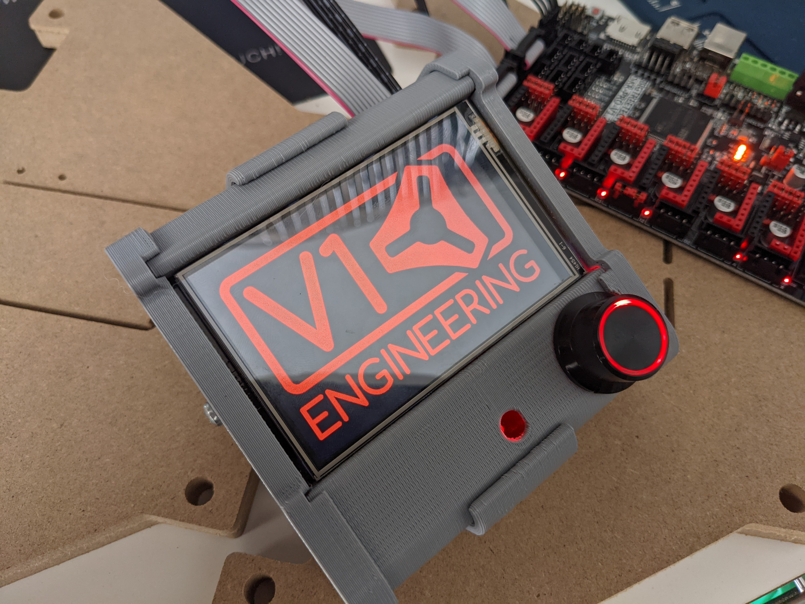{: loading=lazy width="400"}

### Flyfisher604 SKR Pro v1.2 and TFT E3 v3.0 Case

A three-part case (lower box, top lid, and sloped TFT screen) that includes:

- Ventilation on two sides of the lower box
- Two fan mounts with integrated grates on the back of the sloped TFT screen
- Built in standoffs for the SKR Pro board and TFT screen
- Opening on TFT sloped screen mount exposing the SD card slot
- Openings for DB25 and DB15 connectors (with mounting screw holes) to interface internal wiring to MPCNC (or use these as pass throughs)

Available [here](https://www.thingiverse.com/thing:4678675) on Thingiverse.

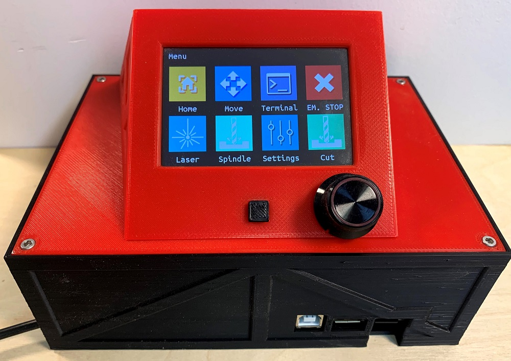{: loading=lazy width="400"}

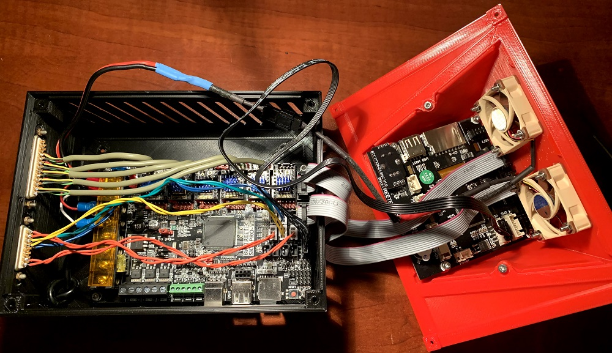{: loading=lazy width="400"}
