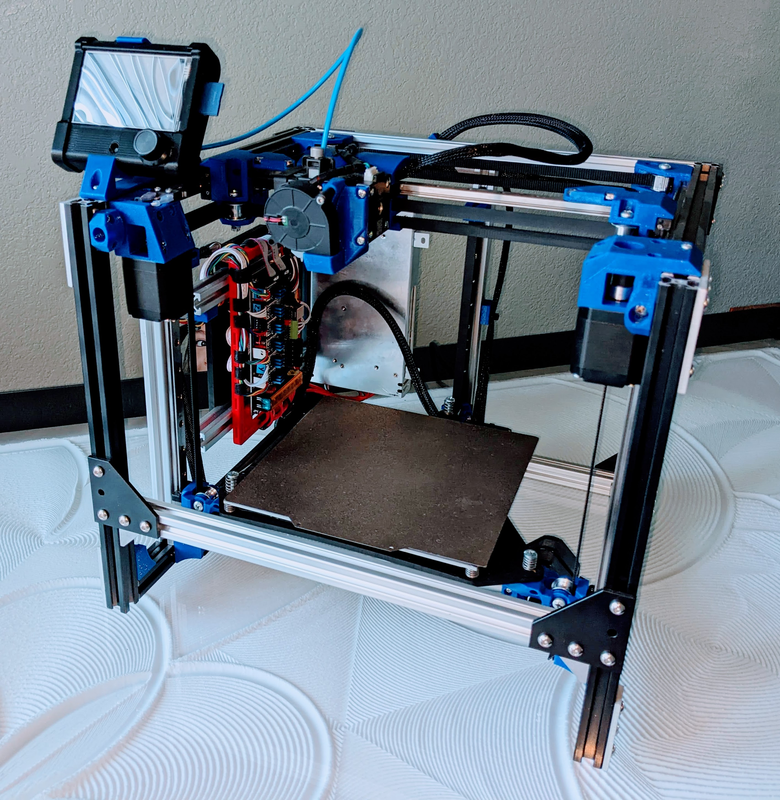
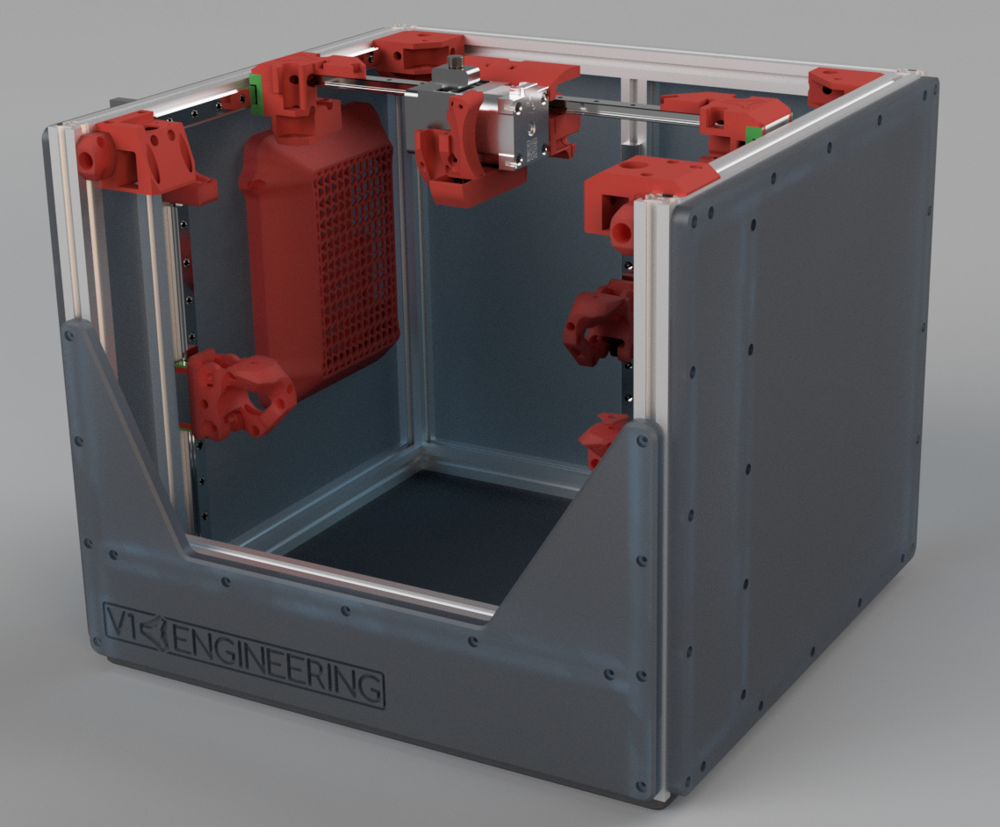
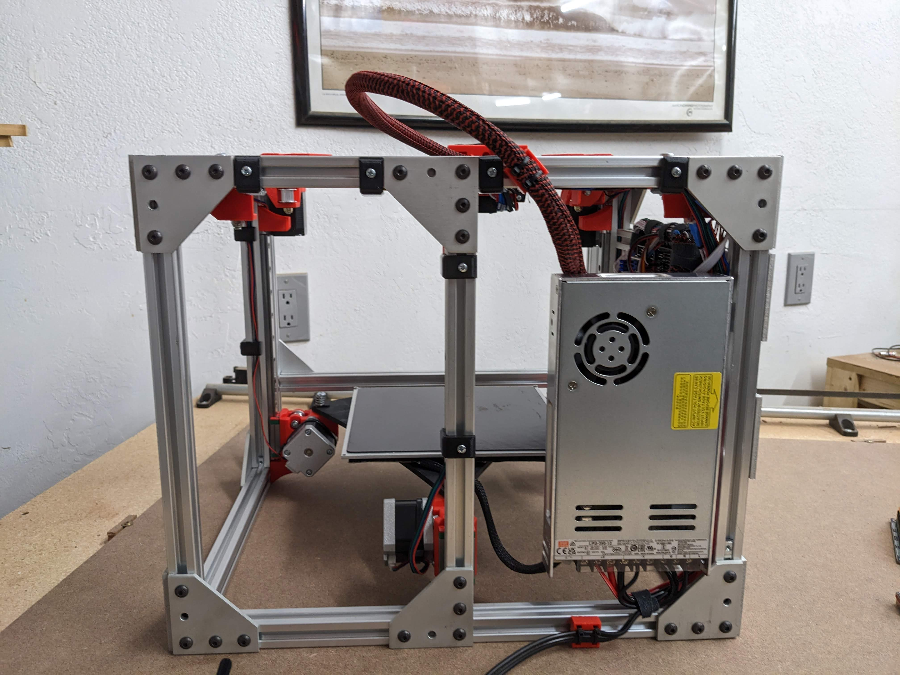
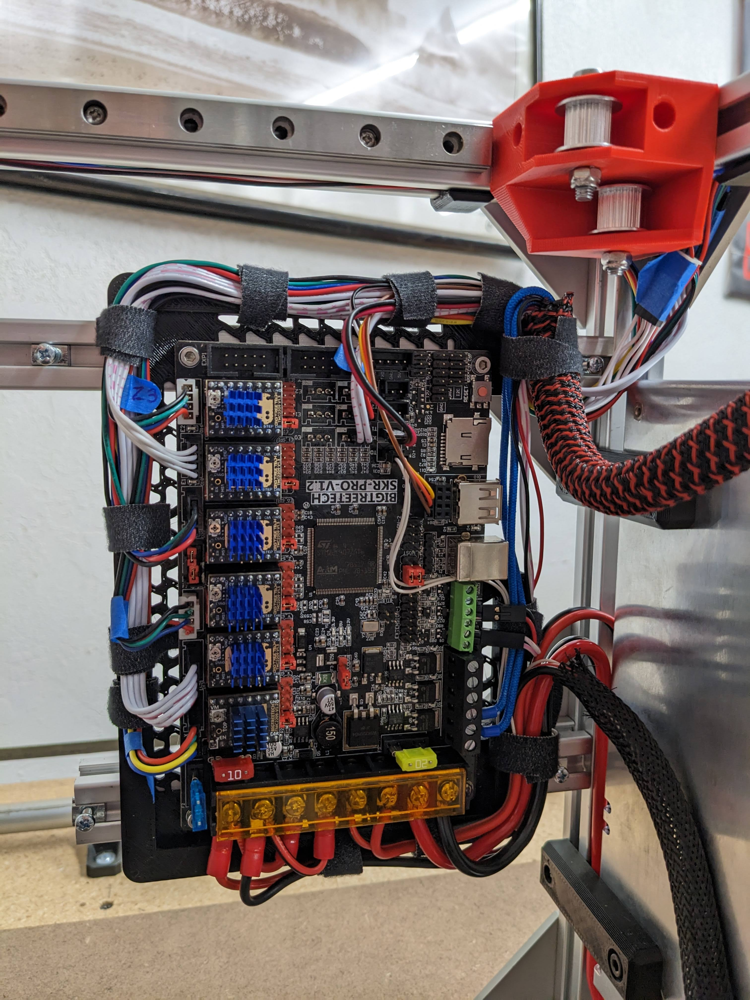
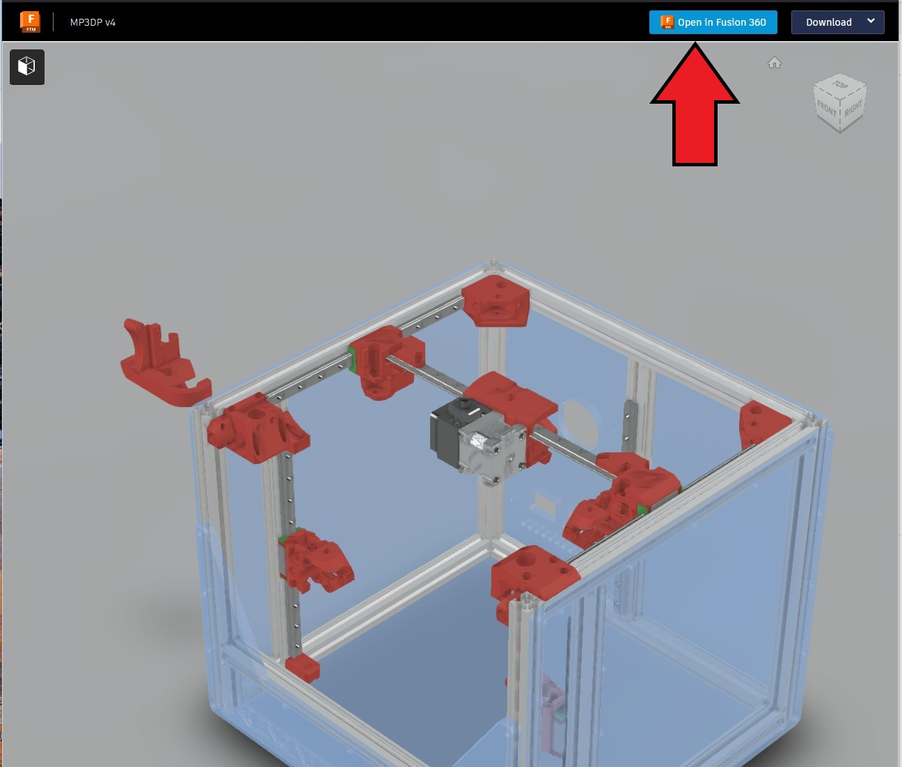
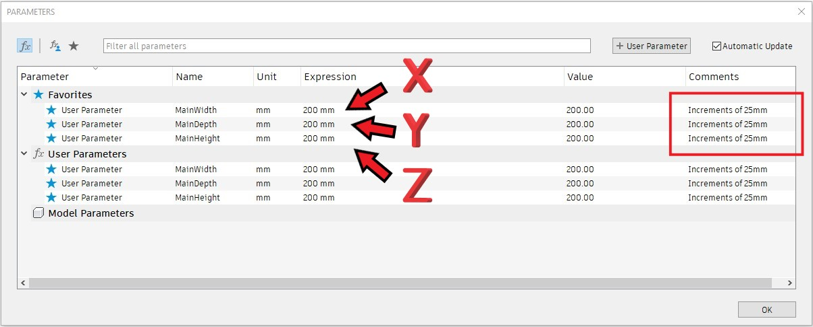
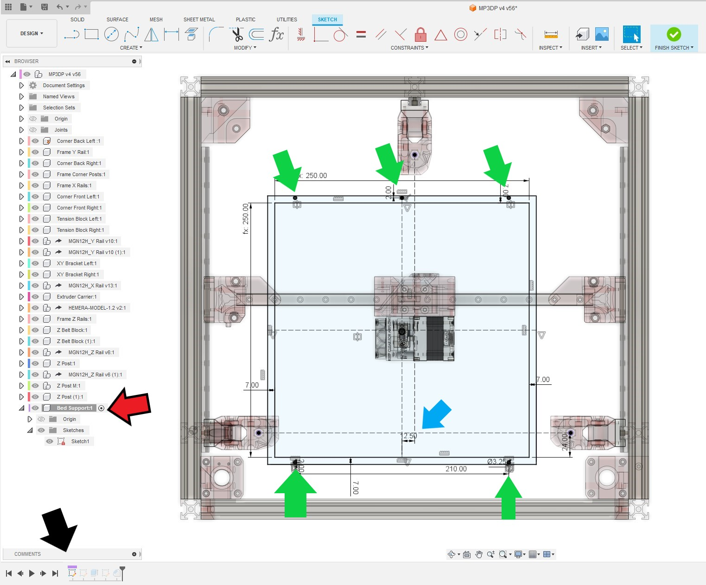
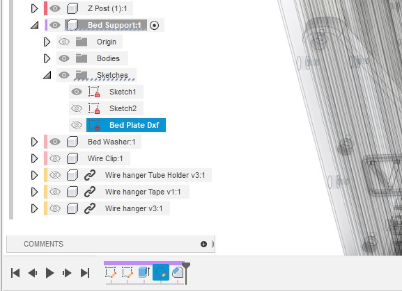

# MP3DP v4 CoreXY

Having fun, this is the second CoreXY version for me, 4th printer design overall. Works fantastic, can be scaled on all axes. Physical and mesh bed leveling. You will need a 6 driver board for this one. Linear rails on all axes, belt drive Z axes.

The V1 Engineering printers are not as well documented as the CNC's. Building a printer is surprisingly much more difficult than making a large CNC. This is very much DIY, ask questions in the forums, and we will help you out and hopefully fill in the details here as we go.

**These instructions are getting filled in as questions are asked**

{: width="400"}

More details to come, [forum thread](https://forum.v1engineering.com/t/repeat-v2/33330/55).**

[CAD link](https://forum.v1engineering.com/t/repeat-v2/33330/85?u=vicious1).

[Files link](https://www.printables.com/model/282346-mp3dp-v4).

{: loading=lazy width="400"}

## Parts
This printer is designed open-ended and open source. There are so many variables to making a printer the way YOU want it I can not possibly cover everything. I will list how I made it, that will be the easiest path to follow, and from there I will try to provide tips and tricks to modify it to suit your needs. For example, I use a BLTouch, you can use anything you want just know you will need to modify your extruder mount to fit it and edit the firmware accordingly.

### Electronics and specialized printer parts

**Control board**, You will need at least 6 drivers. I have used the [SKR Pro](https://www.v1e.com/collections/3dprinter-parts/products/skr-pro1-2-6x-2209-drivers-tft35-e3-v3) with Marlin, a sample config is available in the [marlin builder](https://github.com/V1EngineeringInc/MarlinBuilder/releases). Here is an extra [2209 driver](https://www.v1e.com/collections/miscellaneous/products/trinamic-tmc-2209-v1-2-uart-drivers). ~$147

**5 steppers**, The Z steppers can be quite small, the X and Y steppers in a core XY should be higher end so speed is not an issue. [Good Shop Steppers](https://www.v1e.com/collections/3dprinter-parts/products/nema-17-76oz-in-steppers) ~$57

2 [Pulleys](https://www.v1e.com/collections/3dprinter-parts/products/pulley-16-tooth-gt2-10mm) ~$5.60

2 [Smooth idlers](https://www.v1e.com/collections/3dprinter-parts/products/20t-idler-gt2-10mm) ~$4.80

6 [Toothed Idlers](https://www.v1e.com/collections/3dprinter-parts/products/idler-10mm-20t-5mm-bore) ~$14.40

Belt [10mm GT2](https://www.v1e.com/collections/3dprinter-parts/products/gt2-10mm-belt) length calculation needed. Rough estimate 4x(X length)+4x(YLength)+3x(Z length)+ 750mm. ~$10

Endstops, 2 X and Y, Z uses the probe. [Shop Endstops](https://www.v1e.com/collections/miscellaneous/products/limit-switch-endstop) ~$3.20

Power Supply, 12-24V make sure all the components match this voltage. 45W+ for printer and hotend, Heated beds needs 300W plus unless you are doing mains powered. [Example](https://amzn.to/3M2Io3I) ~$25

Heated Bed, DC beds are easy, AC beds are faster but require a Solid State Relay. ~$25

PEI sheet or other print adhesion methods. ~$30

Bed standoffs, silcone tube, or springs ~$1

Linear rails, sizes per the CAD, Linear rails will be X=Usable+100mm Y=Usable +50mm Z=Usable+50mm. [Example](https://amzn.to/3W48Azh)  ~$95

Extruder -I used the [Hemera](https://amzn.to/42WjARt) ~$170 

Probe - I used the [BL Touch](https://amzn.to/42yp3hS) ~$40

Total for this section ~$627

### Printed Parts

[Files link](https://www.printables.com/model/282346-mp3dp-v4).

Less than a spool of filament, IF you print them yourself ~$20

There are lots of wire clip options in the CAD.

### Hardware and frame

The frame can be just extrusion, extrusions and panels, if you are hardcore you can build it out of just panels but, I found that to be too seasonally variable to have an accurate printer. Extrusions and panels is the easiest if you have a CNC to make the panels. If you use panels and extrusions you will use M3x10mm screws and T Nuts, just extrusions you will use whatever your brackets come with (M5 and T nuts).

Hardware, linear rails all use M3x8 (plus the one stepper mount marked with an “8”, "Y" stepper). Min 3 per rail +1 (16), max 1 per 25mm of rail +1 (30+).  

M2.5x12 for the endstops, 4 qty

M3x10mm for the steppers (19), X rail connection (4), rail bearing blocks (24), printed parts to frame (20), Optional panels (~80). ~150 qty+

M5x30 & nuts for all of the assembly. ~17qty

Quantities vary depending on build size, more info to come for the assembly.

Slide in T nuts are better than twist in. You will need some of both.

Cut all your rails a 2-3mm short so you have some room to adjust for square. There is no advantage to a tight fit on the extrusions. If you are using panels, you can leave 5mm of room and even more on the Z extrusions to allow for wire management.

~$100

### Cost 

The running totals here can vary, ~$750 if you buy everything new. If you have any parts you can reuse than you can quickly bring that price down.

## Assembly

I find it best to start with the back of the frame, build it as accurate as possible, and use that as your reference for all other frame pieces.

The X dimension (left to right as you face the printer) is by far the most critical. This makes the X rail fit into the printed pieces.

Belts, cut the belts to a point if you are having a hard time passing them through the slots. If they do not stay put a piece of filament in the loop.

### Squaring and calibration

#### Frame squaring

Frame squaring takes the longest and the more perfect you get this, the easier it will be to get dimensionally accurate parts. This mainly consists of measuring the diagonals of all faces of the frame and making them match, to the best of your abilities.

#### Printer Calibration

X, Y, and Z dimensions should be spot on, the axes are geared. 

Acceleration, jerk/junction deviation, and extrusion temp are all easily testable and tuned.

Make sure to calibrate your E steps to your extruder with the 100mm extrusion test.

The part I spend the most time on is testing diagonals. For example, printing a large square on the bed, measuring the diagonals, and ensuring I am printing squares. This course adjustment is the position of the X rail (it has some wiggle room in the 4 screws), the fine adjustment is actually the XY belt tensions (if you tug on a belt you will see how it tweaks the X rail position. From there, the Y rails can be adjusted in relation to the Z rails. If you were to print something tall if it is leaning or not 90 degrees one of you Y rails can be moved up or down to compensate. I am able to get 150mm diagonals in XY (flat), YZ (tall front to back), XZ (tall left to right) within 0.1mm with a few test prints. If you are not really printing dimensionally critical functional parts, you can mostly skip this step.
Make sure not to overtighten the belts, plucking them you should barely get a sound. Since it is doubled up, 1/16 turn of the tensions screws provides a lot of movement. You can easily stall your steppers with too much belt tension.

## Wiring and Electronics

Stepper location
Z1 to Z port
Z2 to E1 port
Z3 to E2 port
|  3  |
|     |
|1   2|

### Firmware

Firmware is in the builder for an SKR Pro, V13RP_V4_SkrPro_2209-2.x.x.zip , configured for 200x200x200. If you make size changes you will need to change the bed size, and/or mesh size, and/or Z height. Then recompile and flash.

{: loading=lazy width="400"}
{: loading=lazy width="400"}

{: loading=lazy width="400"}
{: loading=lazy width="400"}
{: loading=lazy width="400"}
{: loading=lazy width="400"}
{: loading=lazy width="400"}

{: loading=lazy width="400"}

{: loading=lazy width="400"}
{: loading=lazy width="400"}

## Resizing

Some rules for resizing. Your X dimension has to be in multiples of 25mm. All of the other axis can be any length you want, the CAD just might look a little funny with the rail hole spacing, that is just cosmetic in CAD. No functional issues other than rails are typically sold in multiples of 25mm. 

{: loading=lazy width="400"}

 * Open the link wither on this page, or the Printables.com page.

---

{: loading=lazy width="400"}

 * Click the link to open in Fusion360

---

{: loading=lazy width="400"}

 * Open the Parameters file. It will appear blank.

---

{: loading=lazy width="400"}

 * Click "Modify"
 * Click "Change Parameters"

---

{: loading=lazy width="400"}

* These number represent the **Usable area** of your bed, and how tall you want the Z axis.
* Note it is best to work in multiples of 25mm. It is a must for the X axis, but you can do whatever you would like for the X and Y axes.

---

{: loading=lazy width="400"}

 * Save the file, and close it.

---

{: loading=lazy width="400"}

 * Open all three of the rail files. All at once or one at a time.

---

{: loading=lazy width="400"}

 * Click the update icon at the top (red arrow).
 * Save the file and close, for each file (black arrow).

---

{: loading=lazy width="400"}

 * Open the complete assembly.

---

{: loading=lazy width="400"}

 * Update and save this new assembly.

---

### Bed Resizing

{: loading=lazy width="400"}

 * Open the bed support component by clicking the small circular button next to it (red arrow).
 * The usable area should already be correct but you can adjust the rest to fit your specific bed.
 * Open the first sketch (black arrow). 
 * From here you can adjust the mounting hole locations (green arrows).
 * You can also move the center of the bed to account for the nozzle offset. The Hemera is offset by 12.5mm.
 * "Finish Sketch" to save any changes.

---

{: loading=lazy width="400"}

 * You can fine tune the mounting hole sizes here.
 * The strain relief can also be adjusted.

---

{: loading=lazy width="400"}

 * The step will let you adjust the plate to work for 3 or 4 mounting hole beds.
 * Any area in blue wil become part of the component.

---

{: loading=lazy width="400"}

 * This is the sketch to export for cutting, just right click "Export DXF".

---

{: loading=lazy width="400"}

 * Click the icon at the top to get the full assembly back.

---
