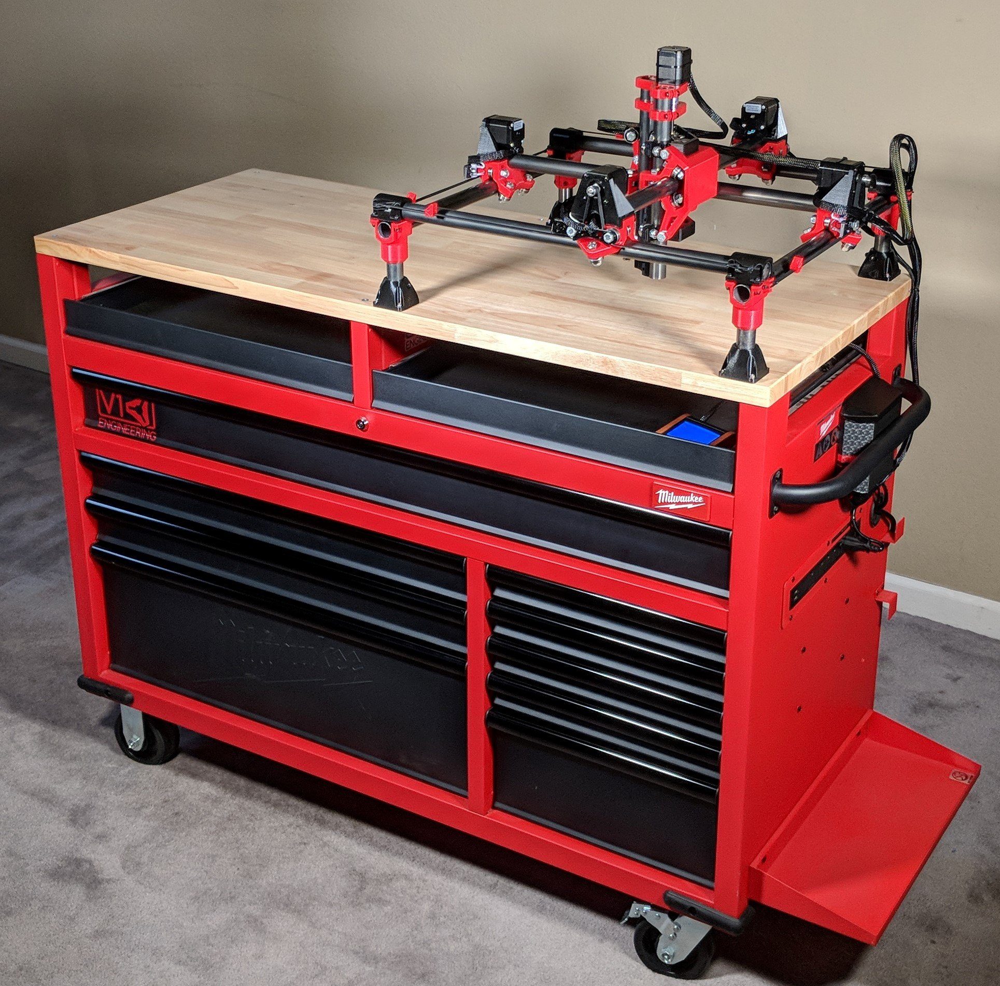

# This is an Inexpensive CNC Platform
{: loading=lazy width="650"}
 
## The Mostly Printed CNC

The Mostly Printed CNC (MPCNC) is a platform to precisely control motion. This can easily be a milling machine, 3D router, 3D printer, laser cutter, vinyl cutter, CNC plasma cutter, you name it.

## Cost

All components are easily sourced, or you can buy the parts from this site. Here is a price breakdown.

* The [Bundle](https://www.v1e.com/collections/parts/products/mostly-printed-cnc-parts-bundle-primo-version) has all the hardware, electronics, and Jackpot CNC Control board $301 + shipping if international.
* 20′ of [Conduit](https://docs.v1engineering.com/mpcnc/calculator/) **≈\$12** (which are cheaper to source locally than to ship) – or stainless-steel tubing or DOM Tubing for ≈$65 .
* Plastic parts, filament, less than 2 spools **≈\$35** if you own a 3D printer. If not, buy the printed parts from [here](https://www.v1e.com/collections/parts) for $165.
* Tool. Either a [Kobalt](https://www.lowes.com/pd/Kobalt/5014100299), [Makita](https://amzn.to/3sfwDB0), [Dewalt](https://amzn.to/1MoBSQq), [import spindle](https://amzn.to/3dkKgl0) ~$99, or anything else you might want to bolt on, [laser](https://amzn.to/37OcdQK), [drag knife](https://www.v1e.com/collections/parts/products/drag-knife-vinyl-cutter), foam cutting needle (awesome), etc.

Total Cost… if you have a 3D printer Under $450, $577 if you buy the printed parts from here.

Let's drive that price home one more time. You can have a CNC router for all sorts of work [Users project Gallery](https://forum.v1engineering.com/tag/gallery-mpcnc), Laser cutting and etching, yes aluminum milling is possible, even making it a plasma cutter, for under $580. That is all you need to spend, throw in a few endmills and you are still under $600.  **There is no other machine more versatile than the Mostly Printed CNC at any price point.**

## Specs…

Not easy to make a specs page when it can have almost any specs you want. The idea behind this is to be extremely adaptable, easy to self source, and inexpensive. Why buy a single use machine when you can have one that does it all for less than the cost of any single function machine. No proprietary hardware or software, build it any size and shape you want (more on this later), buy it from this site or source it all yourself, helpful forums, low cost, and capable. What more could you ask for?

 
## Size

- All axes can be any length you prefer, anything over ~3′ (1M) would be best to start with a LowRider CNC, of course smaller is better.  The kit comes with enough belt for up to 48″ of total outer X and Y axis dimensions (eg 24″x24″, 36″x12″ or any other combination).

- The smaller you make this the faster you can move it and the more rigid/accurate it will be, and more importantly the easier it will be to get the desired accuracy.

- The linear motion is ball bearings on electrical conduit (or stainless steel)… seriously, easy to use and source. More information on this [here](https://docs.v1engineering.com/mpcnc/intro/#size). If this machine isn’t big enough I have also designed the [LowRider CNC](../lowrider/index.md), all the same specs and resolution just designed to be bigger!
 
## Power

- X and Y axis are powered by 2 stepper motors each, and a single stepper for the Z axis. The standard would be NEMA 17 in any torque preferably 42 OZ/in and above (the kit comes with 76 OZ/in +). No need for NEMA 23’s or their required larger drivers,  torque is not one of this machines issues.

- Belts are used for their accuracy, ease of use, and price. Ball screws are expensive, require tuning, and periodic maintenance / adjustments.

 
## Control

- This is all controlled by any control board you like. 5 drivers are prefered, but a minimum of 3 is required. [Marlin](https://github.com/MarlinFirmware/Marlin), [GRBL](https://github.com/grbl/grbl), and Just about any firmware will work.

 
## Software

- There are plenty of free or really inexpensive software options available for CAD, CAM, and just controlling the machine. I suggest [Fusion 360](http://www.autodesk.com/products/fusion-360/overview), [ESTLCam](http://www.estlcam.com/), [Repetier-host](http://www.repetier.com/), etc.

 
## DIY

- Besides using either common imperial or metric hardware as listed, the rest of the machine is easily 3D
    printable, RepRap style! A full list of required hardware can be found [here](PParts.md#hardware), and the files for the printed
    parts can be had [here](PParts.md).

- All of these things can be easily assembled with basic hand tools, no specialty tools, power tools, or precision cuts required.
 

{: loading=lazy width="450"}

How it all started.

{: loading=lazy width="450"}

The [Burly edition from 2016](https://forum.v1engineering.com/t/red-black-and-wheels/7303)

{: loading=lazy width="450"}

And finally the current Primo Version!

## More info

To see some of the capabilities, and some interesting builds check out some [videos](https://www.v1e.com/pages/social), or the user galleries, [MPCNC gallery](https://forum.v1e.com/tag/gallery-mpcnc), [LowRider CNC gallery](https://forum.v1e.com/tag/gallery-lowrider-cnc).
