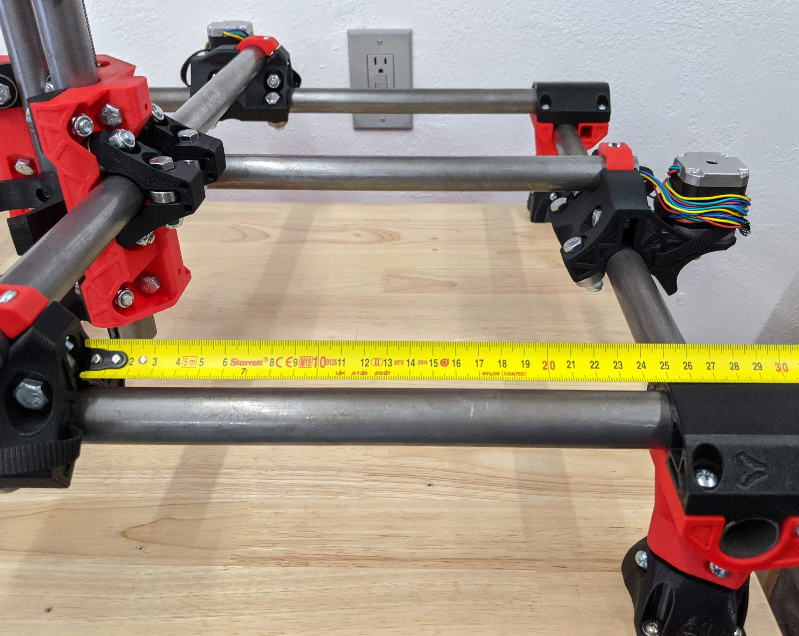
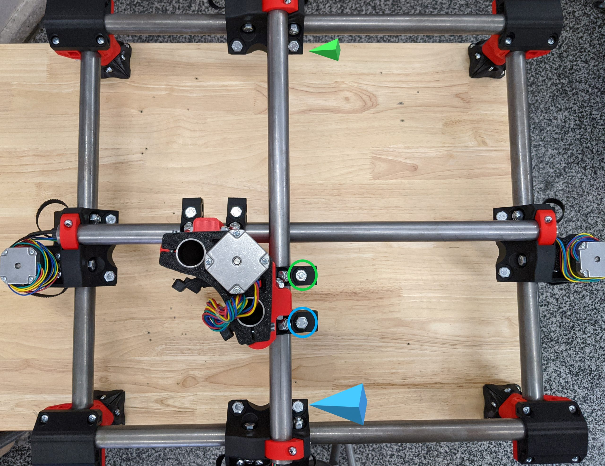

# Squaring the Gantry

## The Goal

{: loading=lazy width="400"}

* This step is just to get the gantry rails as perpendicular to each other as possible.
* The squarer your build, the more accurate your cuts.
* Previously you squared your base, then the Trucks to the base, and now you are squaring the Core. If you use dual endstop firmware you will be able to dial this in even further.
* Machine accuracy is much easier to achieve with the Primo version.

## Test

{: loading=lazy width="400"}

* An easy test is to measure and compare the Trucks as they sit.
* You should have no belts attached at this point.
* Move the gantry around by hand and place it roughly in the center of your work area.
* Measure each Truck pair without moving the gantry in the process.

{: loading=lazy width="400"}

* Measure the other Truck.
* Test both pairs of Trucks.
* Move the gantry around and test all four again. The numbers should be very close to the first test.

## Adjust

{: loading=lazy width="400"}

* Start with whichever gantry rail has the most error.
* Tightening a Core Clamp will move the rail and Truck away from that bolt. 
* The outer Core Clamps have the largest effect.
* Use small adjustments. 1/16th of a turn at a time.
* After each adjustment move the gantry around and test the Truck pair distances again.
* Repeat this a few times.

!!! Tip
    This should be very small adjustments and you are looking to get them within 1mm. If you
    over tighten them they stop moving. So, if the Trucks are showing no effect, loosen the tension
    bolts all the way and start again. The minimum tension was set in the Core building step,
    so you will begin by tightening the clamps. At some point you can also loosen them a bit for the
    opposite effect.

___

Be there or be square....wait what???
