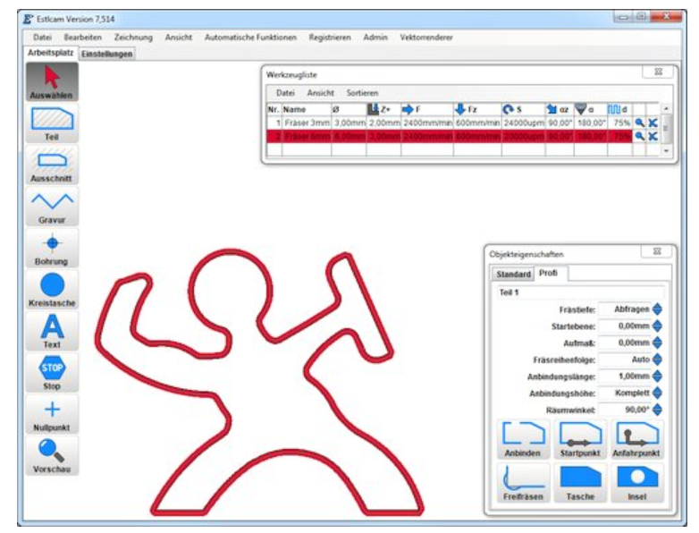
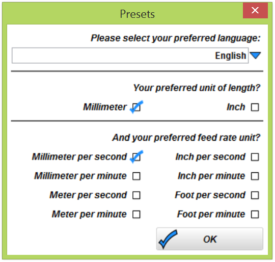
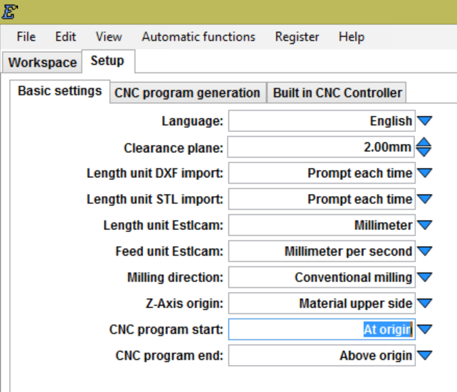
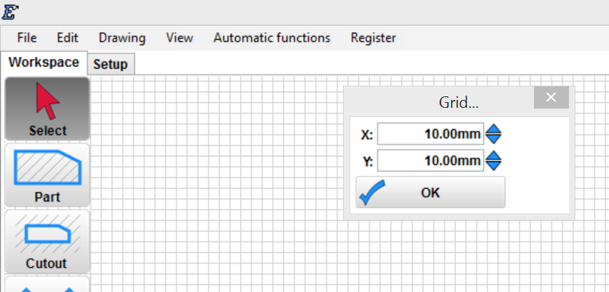
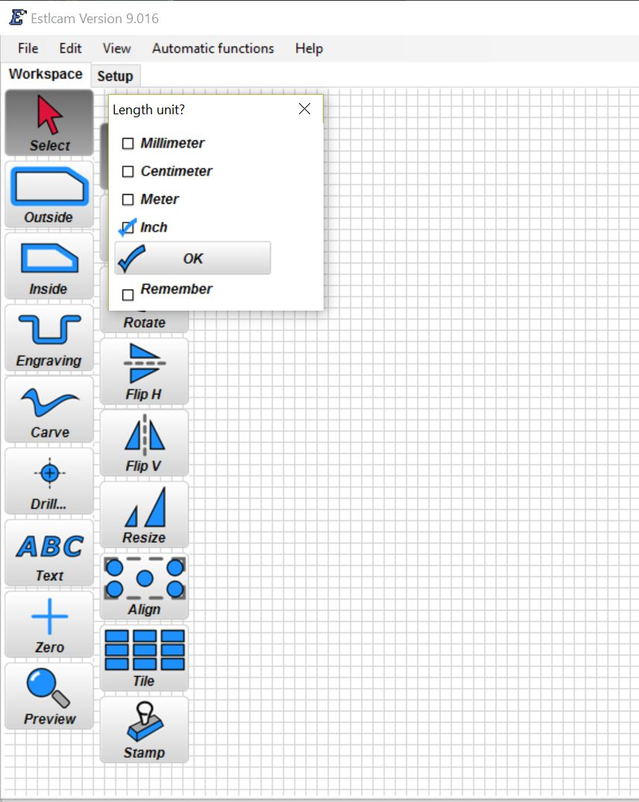
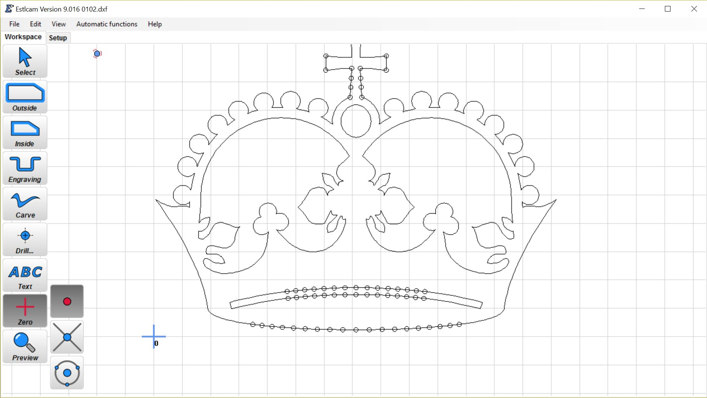
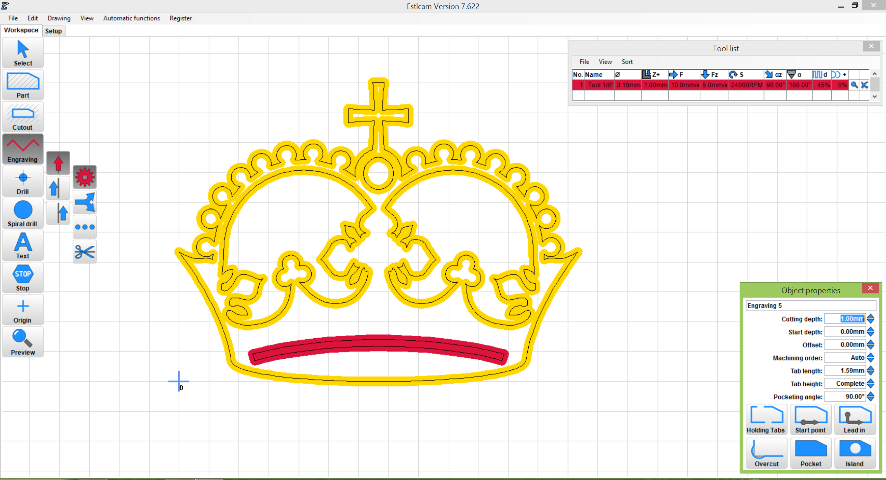
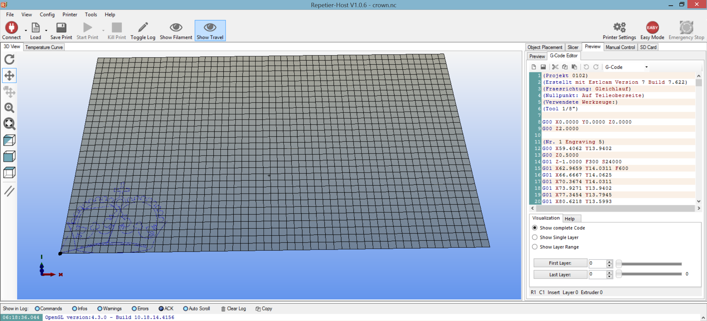
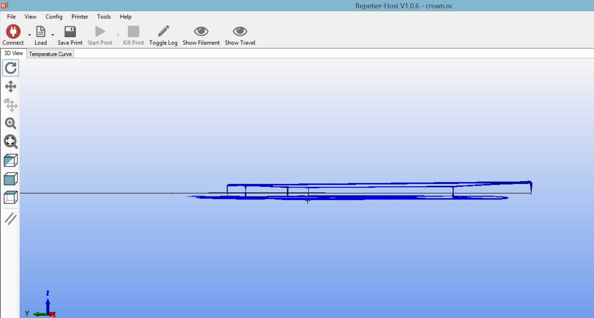

# Estlcam Basics

[Estlcam is found here.](http://estlcam.com)

{: loading=lazy width="400"}

**EstlCAM is for generating GCode.**

This software seems to do everything I want. It also seems to be translated into every language I’ve
ever heard of, if not you can add translations in the software. The installer is in German I think
but the options are easy to understand. Please buy a copy if you find this works for you.

## Step one – Install Estlcam

Install Estlcam. Using the default options in the installer, add Icon to start menu and desktop. The
first window that pops up I set the language, change the display units, and set it to show the feed
rate in mm/s on the tool popups.

{: loading=lazy width="400"}

After you click okay close Estlcam and restart it to update the settings.

## Step 2 – Setup

After restarting Estlcam, open the setup tab, these are the settings from the first window plus a few extra.

{: loading=lazy width="400"}

Changing the clearance plane to something a little smaller really speeds up a job since the z axis
is the slowest. This is how far above the material it should travel to before it moves. You should
change the milling direction depending on what kind of material you are cutting, more on this in
another post. Setting the z-axis origin to the top of the material makes it easy to set the home
position, along with that is program start – at origin. Choosing to end the program “above origin”
is safe, “above last position” is the fastest.

{: loading=lazy width="400"}

The creator of Estlcam recently updated his software for us! In the CNC Program Generation tab,
choose Marlin (if you are using my firmware). **Important – Set feed unit to mm/min-** (this is what the
marlin firmware needs). Change the file extension “gcode” so all the programs recognize it.

{: loading=lazy width="400"}

Next up is the travel feed rates. 2100/60=35mm/s, 480=8mm/s (keep the Z low)

{: loading=lazy width="400"}

I delete all the default tools and use this as a conservative test speed setting for an 1/8″ flat
endmill in wood. Do not exceed 8mm/s in the z plunge field unless you know what you are doing and
know what firmware limits you have.

You are ready to generate some GCode.

## Step 3 – 2D gcode, Good for pen plotting or 2D milling (cutting things out)

Grid Size. DXF files are crazy sizes sometimes so to make sure your DXF is the right size change the
grid. Found in **View>Grid** I set mine to 10mm or 25.4mm=1in.

{: loading=lazy width="400"}

For this 2D or 2.5D work .DXF files are used. You can use any vector program to make them,
illustrator, SolidWorks, etc. Get some files from here, (Need a new source, sorry).

I used this one in the [video](https://youtu.be/s8YwkcK3P9U), [Crown Vector](../img/old/2018/08/0102.zip).

Open DXF. **File>Open** – If your DXF is completely the wrong size try again with different initial
units.

{: loading=lazy width="400"}

This is what the crown looks like imported in inches as the initial units. This is whatever units
you save your DXF as.

{: loading=lazy width="400"}

## Step 4 – Scale / Re-Zero

The crown imported at about 55mm wide I want about 150mm wide.

**Select>Resize>Drawing Layers**, then click on the DXF to select it. I scaled the crown 250x to get it
to 150mm (5 3/4″).  Zoom out to see your DXF.

{: loading=lazy width="400"}

**Zero>Create arbitrary point**, then select outside of the DXF paths. This is how to set your origin
(or Home). The little blue plus symbol is what your machine sees as 0,0 (x=0, y=0, generally the
lower left corner of your work). When you start your program the machine will work to the right and
above where you start it from (represented by the blue plus). Some people like to work from the
center for round or oval objects.

{: loading=lazy width="400"}

## Step 5 – Select the tool paths

To use the pen you want to draw on the line so use engrave (tool centered on line), if you were
cutting a part you can choose part (tool edge on the outside of line), or cutout (tool edge in
inside of line). Click **Engrave** then just click on each line segment.

{: loading=lazy width="400"}

## Step 6 – Save

Export. **File>Save CNC Program**. Give it a name. You will get a depth popup, for the pen I use 1mm or
less, anything else, set it to the thickness of your material plus a bit to cut all the way through.
You can then preview the path.

## Step 7 – Control Software

Open [repetier-host](http://www.repetier.com). load the .gcode (or .nc , .ngc)  file you just saved. If you have the bed size
adjusted you can get a sense of scale. If you can’t see the lines check the box Print Preview>Show
Travel moves.

{: loading=lazy width="400"}

View it from the edge and you can see that the path is below your z-home, and the movements are
above z-home.

{: loading=lazy width="400"}

Don’t pay any attention as to where it is shown on the bed. It will start where ever your head
currently is.

## Step 8

Start. Put the tip of the pen (or tool) a hair above where you want it to start and hit run. It
should pick up, move, drop down and go. If it goes down first and doesn’t pick up between moves
your z axis is backwards. [Flip the plug](../software/reverse-motor.md).

## Test File

[Test Crown 12mm/s GCODE](../img/old/2015/09/Test-Crown-12mms.gcode)– [Test Crown 12mm/s Zipped file](../img/Test-Crown-12mms.zip).

This all it takes to plot with a pen or do basic 2D (2.5D) milling, some of the most common
things this type of mill is used for. Make sure to adjust your tool and its settings depending on
the material in use. Always do a test cut!

Here is an old video, the new [Primo pen / knife holder](https://github.com/V1EngineeringInc/MPCNC_Primo_Tool_Mounts/tree/master/Knife_Pen_Mount) has built in spring so you will get even more consistent results.

<iframe width="560" height="315" src="https://www.youtube.com/embed/s8YwkcK3P9U"
  title="YouTube video player" frameborder="0" allow="accelerometer; autoplay;
  clipboard-write; encrypted-media; gyroscope; picture-in-picture" allowfullscreen></iframe>

This video is of the very first MPCNC, drawing the very first test crown (that I still have framed in my room). This video still makes me smile ear to ear, I am very proud of it even though we can do so much more and so much faster these days. At the time this was amazing and I hope your first crown feels the same way.

P.S. the crown's "jewel" is not perfectly round. 

## Milling Basics

Once you can do some drawings and you are ready to try and cut something, here are some [Milling Basics](../tools/milling-basics.md).
