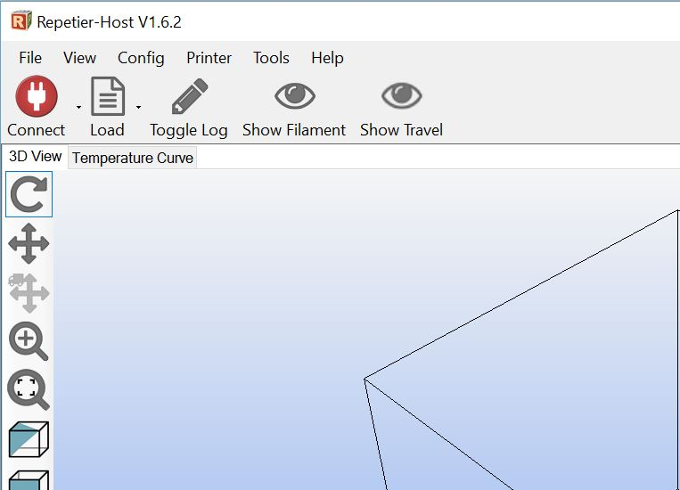
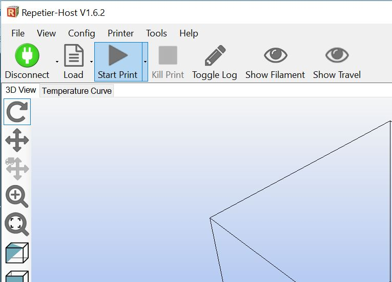
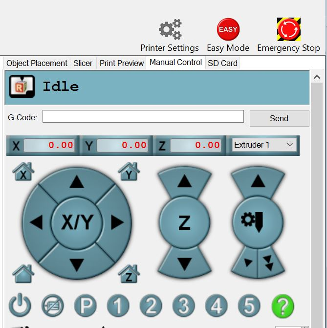

# Getting Started

## First Use

Install the [Arduino](https://www.arduino.cc/en/Main/Software) software and its drivers before you plug in your control board. You might need
its included drivers, so it is best to let them install.

**MAC User?** -IT should work as is but here is some [info](https://forum.v1e.com/t/cannot-connect-to-ramps-arduino-mac-linux-windows/4066#post-11485) 
if you find you are having issues you might need to change the firmware baud rate and perhaps a different driver.

## Firmware

If you bought a system from me the firmware is pre-loaded, and you do not need to make any changes.
[Marlin](../electronics/marlin-firmware.md) is the firmware currently used and it is pre-flashed on the control board included in the
kit ([download the pre-configured files here](../electronics/marlin-firmware.md)). If you are building your own feel free to use any
board/firmware you want.

## Testing

**Never plug or unplug anything into the control board while there is any power, USB or power
plug!**

It is best to start with [Repetier-Host](http://www.repetier.com/) It is an easy program to use (do not use repetier server),
just in case here is a [basic set up](../software/repetier-host.md).

Move your gantry to the center of your build space and make sure the z axis is roughly centered in
its travel. You never know which way it’s going to go!

With all the motors plugged in, plug in the USB cable and the power to the control board and hit
connect in the upper left corner of repetier, it should take a few seconds and turn green to
indicate it is connected.

{: loading=lazy width="350"}
{: loading=lazy width="350"}

!!! note 
    If you are using a dual end stop firmware flashed board, you have to have the end stops
    properly connected first, [Info](https://docs.v1engineering.com/electronics/dual-endstops/). If you have a series flashed board no end stops are needed.

You can now use the control in the manual tab to move the machine. The arrows allow for .1, 1, 10, 50mm 
movements. Start small 1 mm at a time. The arrows should move it in that direction.

 * __X positive__ (Right arrow) should move __Right__, X negative should move Left,
 * __Y positive__ (up arrow) is back or __away from you__, Y negative is towards you.
 * __Z positive__ (Z up arrow) moves the z axis __up__, meaning the tool away from the work surface.

If it doesn’t move as expected hit disconnect, unplug the power and USB, any axis that is moving the
wrong way simply [flip the plug](../software/reverse-motor.md). If one stepper is moving the wrong way
power down and flip it’s plug. Power back up and test again.

{: loading=lazy width="350"}
 
## Control Software

Now that your machine can talk to your computer you need to be able to control it. You can either use an
[lcd screen](https://www.v1e./collections/parts/products/full-graphic-smart-controller-big) 
or control software. For the beginners software is usually easier to learn than the LCD screen.

This can move the machine along any of the three axis and can also send gcode generated in any
program (estlcam, slic3r, Image2Gcode, Fusion360, etc.).

[Repetier-Host](http://www.repetier.com/) is an easy program to use, here is a [basic set
up](../software/repetier-host.md). You can also use Pronterface, Matter Control, ESTLCAM, or many
others. Again for the beginners, start with repetier-host (not server).

 
## CNC Step 1 – First Use

Now the machine should be moving around and once you finally get bored of manually moving it around
it is time to put it to work.

Let’s start with [ESTLCAM](http://www.estlcam.com/) I have put together a little walk through using
Estlcam as a plotter. So strap on a [pen](https://www.thingiverse.com/thing:1612207), (or a “spindle” if you know what you’re doing).

The infamous Crown…**Follow the [Basic instructions](../software/estlcam-basics.md)** on how to actually use the machine. Test code
available at the bottom of that page. If you ask for help I will ask about your crown test.

 
## CNC Step 2 – Getting dirty

Now the machine can draw pictures it is time to get it dirty. Hope you didn’t make a white one…

When you are ready to try and cut something, here are some [Milling Basics](../software/estlcam-basics.md).
 
## CNC Step 3 – Getting Creative

[This page](https://forum.v1engineering.com/tag/gallery-mpcnc) and [This One](https://forum.v1engineering.com/tag/gallery-lowrider-cnc) have all sorts of things to try.
