### Kiri:Moto BASICS 

[Kiri:Moto](https://grid.space/kiri/) is a unique browser-based slicer for 3D printing and a tool-path generator for CNC mills and laser cutters. It is completely free and open-source with a focus on privacy and ease-of-use. It is actively being developed and updated.

**Ease of use.**

The author of this document had not previously opened a CAM application,  His prior CNC experience was limited to tracing a “crown test” from the supplied gcode.   Therefore the following is both a testament to just how quickly one can get up and running with Kiri:Moto, and a warning that there may be other, better ways of implementing the software! 

**1) Language**

{: align=left loading=lazy width="l00"} Open [Kiri:Moto](https://grid.space/kiri/) and choose your language from the icon in the top right of your screen.

**2) Preferences Setup**

{: loading=lazy width="600"}

Open the Setup Menu (top of the left hand toolbar) and select “Prefs”.

The default setup should not need changing unless you have some specific requirements, but make sure that you have selected the correct workspace units for your purpose.

**3) Machine Setup**

{: loading=lazy width="600"}

Open the Setup Menu and select “Machine”

Check that the “CNC” button is shaded then select any Standard Device (I used “any generic Gbrl” which seems to talk nicely in Marlin too),  and make the following changes:

- To make changes, click the customize button in the lower right corner of the settings screen.

- Change the Name of the machine to whatever you fancy.

- Enter the build volume of your machine.

- In the **Output** menu check that the file extension is “gcode”.

- In the menu **Gcode Macros**, there is provision for insertion of special instructions for starting gcode, tool changes, and ending gcode, but since this is day one, we’ll ignore those until a slightly further down this page.
- Make sure to hit "Save", and you can export and save your setting locally as well.

**4) Setting up the Operation Modifiers (Right Hand Menu)**

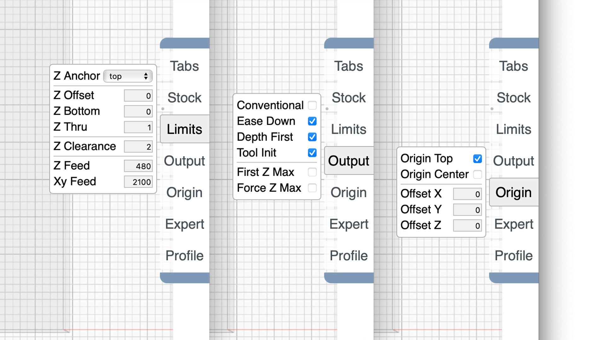{: loading=lazy width="600"}

Click on the **Limits** menu on the right side of the screen and change the following values: 

 - **Z Thru** to (say 1mm) - this is the amount your bit will travel into the spoil board in through cuts.

 - **Z Clearance** - 2mm - the amount your bit will lift above the work while travelling.   Changing the clearance plane to something a little smaller really speeds up a job since the z axis is the slowest. This is how far above the material it should travel to before it moves.

 - **Z Feed** -  this is the maximum Z travel rate in mm/minute, set it to 480.

 - **XY Feed** - sets the maximum XY travel speed - (2100)

The **Output** menu is next.

 - Leaving **Conventional** unchecked will set milling direction at **climb cutting**. You should change the milling direction depending on what kind of material you are cutting. 
 - **Ease Down** will automatically ease linear cuts and spiral plunge cuts. 

 - **Depth First** optimises pocket cuts with depth priority.

Finally (for now) the **Origin** menu;

 - Setting the z-axis origin to the **top** of the material makes it easy to set the home position, along with that is program start – at ****origin**. 

**5)Tools**

Now we are ready to look at custom **TOOLS**.

There is a basic set of tools ready to be modified and there is absolutely no need to create a tool called “Sharpie” but it’s a nice exercise to help create an understanding of how the tool setup works.   Each tool to be used, requires a new setup so that the software can figure out what needs to be done.

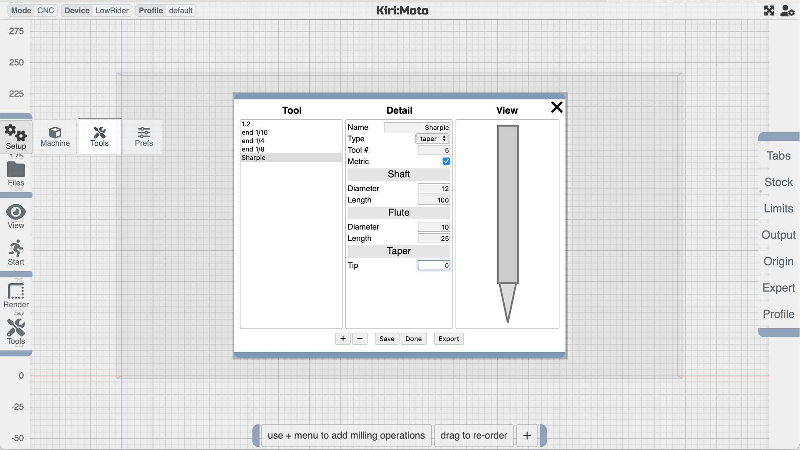{: loading=lazy width="600"}

Go back to the **Setup** menu on the left hand side of the screen, and click on **Tools**. NOTE - in a very rare instance of confusing menus, this is not the "tools: menu that you can see on the screen, it's the one you see when you click **Setup**.

Once you are there the menu is very intuitive, so use it to draw the tool of your choice - things will get a little more serious as you start to fill in the tools you actually have, but for now, why not just copy my Sharpie?

**CONSIDER YOURSELF READY TO GO!**

You are ready to generate some GCode. 

Let’s start with generating some 2D gcode, Good for pen plotting or 2D milling (cutting things out).

Download the [Crown Vector](../img/old/2018/08/0102.zip) drawing, and import the SVG file directly into Kiri:Moto.  Kiri:Moto will automatically convert the 2d drawing to a 3d object with a depth of 5mm so there's no need to fiddle with any other format.

{: loading=lazy width="600"}

Using your paper size as the “Stock” will make it easy to position the drawing, keep the height at 5mm because we have already set up Z0 to be on the top surface.

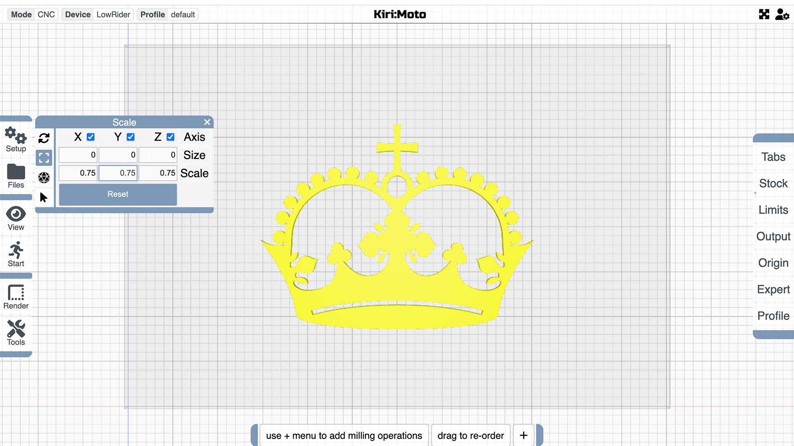{: loading=lazy width="600"}

If the drawing is too big for your taste, pop over to the **Tools** menu (this time the one that you can see on the left hand menu on-screen not the one buried in the setup menu), select **Scale**, and resize it as you wish.

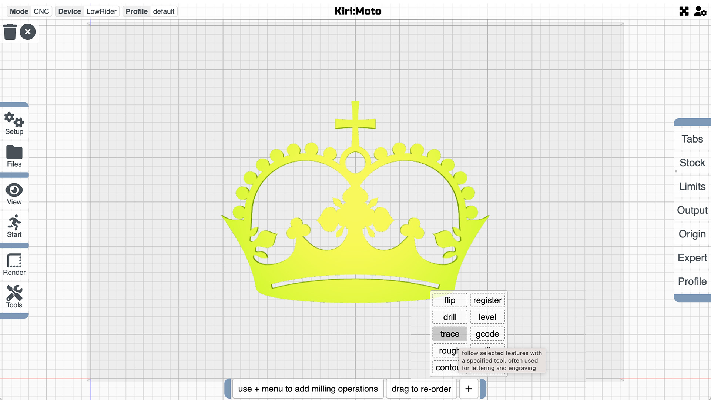{: loading=lazy width="600"}

Now we are getting to the action part!  Go to the **milling operations** menu at the *bottom of the page* and click on the **+**.  From the popup, select **trace**.

{: loading=lazy width="600"}

Set up the **trace** menu to look a bit like this:

 - **tool** - Sharpie
 - **select** “loops” because our edges are all closed loops
 - **type** “follow” for obvious reasons
 - **offset** “center”
 - **spindle rpm** - does not matter
 - **step down** - “0” will keep the tool on the surface
 - **cut thru** - 0 will just make sure!
 - **feed** and **plunge** rates are a bit arbitrary too, but lets see how 250 goes and let’s hope it doesn’t plunge at all or we'll ruin our sharpie!

{: loading=lazy width="600"}

Now click on the little **+**  sign in the bottom of the **trace** popup, you can move your cursor onto the edges you want to trace and click once - when selection is confirmed the trace will appear in red so it’s easy to spot whether anything has been missed.

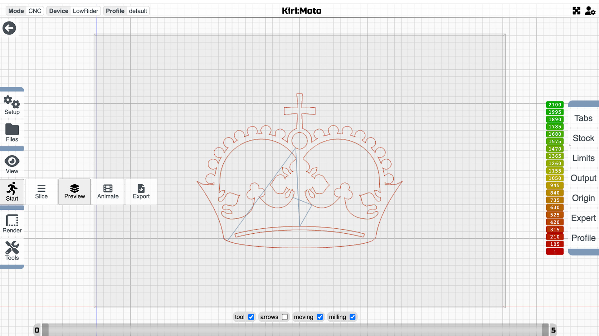{: loading=lazy width="600"}

It’s time to pop back up to the **start** menu and check on our handiwork.  Preview the tool travel path and even check out an animation although for this one, if the tool (Sharpie) is at Z0 there may not be any lines left so it could be a bit uninteresting!

If things work as expected you can export your first bit of gcode and run breathlessly to your waiting machine, where no doubt you’ve had the Sharpie set up for just this minute! 

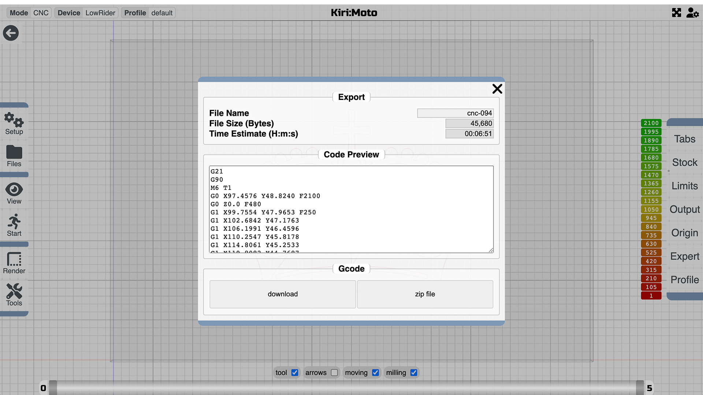{: loading=lazy width="600"}

If you've worked out how to load the gcode into your machine and all went according to plan you should have something that looks a bit like this:

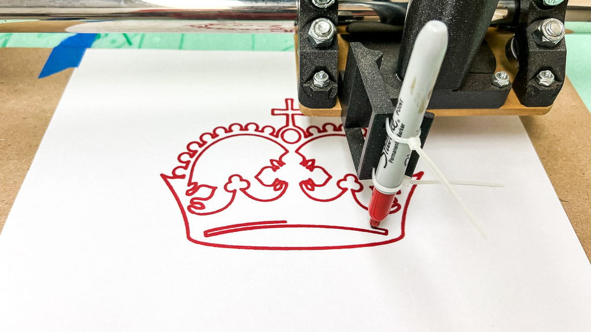{: loading=lazy width="600"}

You are now one of the cool kids! 

### But wait… THERE’S MORE!

While you have Kiri:Moto open and your shiny new V-bit just busting to get dirty, let’s try a spot of engraving.  As always, it would be wise to practice on a bit of rigid foam before you start engraving notes on your mother’s best table because things can and probably will go wrong.

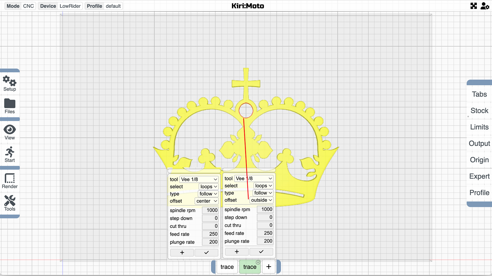{: loading=lazy width="600"}

Reopen the **Trace** menu and swap your Sharpie for your vee bit and, because you want to go a little below the surface this time enter 1mm as a **step** down and again as a **cut thru**.

For your first attempt at engraving foam, 1mm should be nicely visible.

Right now you want to hit “export” and get on with it, and it would be fine if you did but there’s ONE MORE THING you might like to try.

Go back and hit that **+** sign beside the **trace button**, and select *another* **trace** operation.

Set up the new tab exactly the same as the previous one, *except* for **offset**, select **outside**

Now hit the little **+** button in the pop-up and select the circle at the top of the crown.  (Technically it’s not quite a circle but that will do)

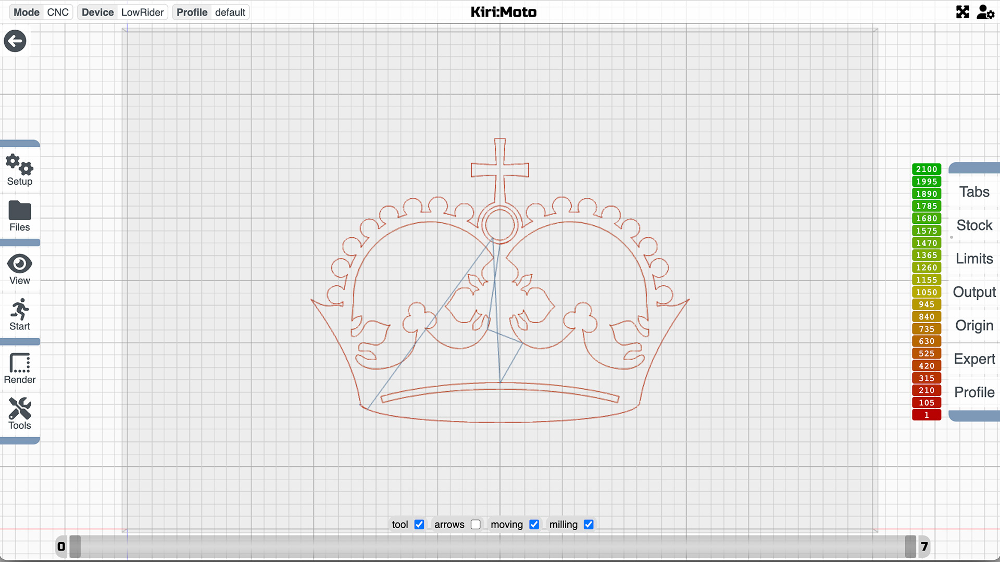{: loading=lazy width="600"}

**Tick** it to save it all (or don't, because *mostly* it saves itself anyway) and scoot back to the **start** button and check out your handiwork in the preview panel.

Miraculously a separate ring has appeared around the circle exactly half the width of your v-bit away.

This is just an example of what can be done by tweaking parameters in what seem to be very simple tools.  If you wish to increase the offset dimension, just set up an imaginary tool that’s twice the width of the offset you want, and the machine will do the rest!

Now you are big enough to go off and get the gcode and see how it goes with a bit of noise and a proper bit instead of a sharpie.

{: loading=lazy width="600"}

I’m happy to call this a result.   The circle came out very nicely and the result held no surprises!  If I wanted to have a crown engraved in a bit of priceless ebony, I reckon I could do that now without changing anything.

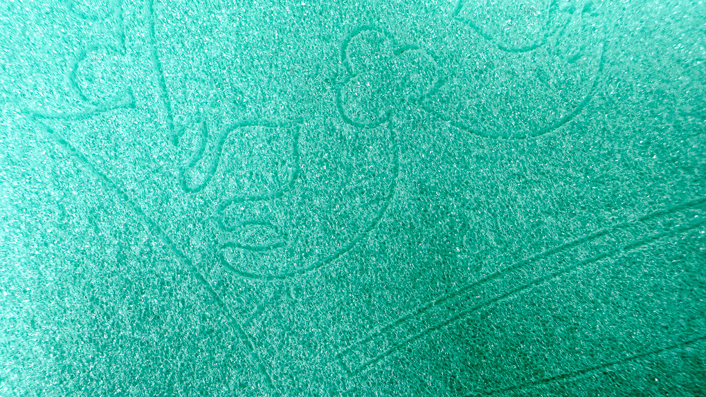{: loading=lazy width="600"}

# AND NOW LET'S CUT SOMETHING OUT!

Actually that’s just a catchy headline, because playing in foam is oh so rewarding when things go right, and not terribly punishing when they don’t.

Here’s a V1 logo lifted from somewhere on this site which presents no real challenge but it will allow us to explore a few operation options. 

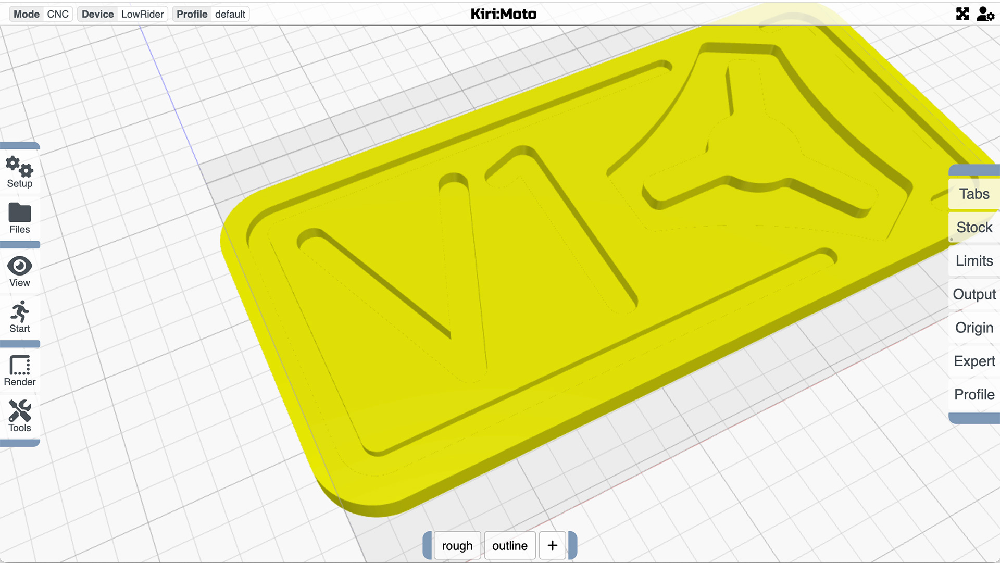{: loading=lazy width="600"}

It’s really simple and given that it’s in foam probably doesn’t even need a “rough-in” stage, but never the less, check this out: 

Go to the **Milling Operations** (it's the one at the bottom of the page) tab and add a **rough** and **outline** operation.

If you poke around in those operation popup menus, you will see that you can vary the amount left in the rough in stage for a finishing pass, then let the outline do the rest.   For now though, since we are in exploring mode,  delete those two windows and we’ll start again taking a different, much more complicated tack.

Before we go on, because we are going to cut this out of a piece of stock, we had better add some **tabs** to keep everything together once the outline is cut out.

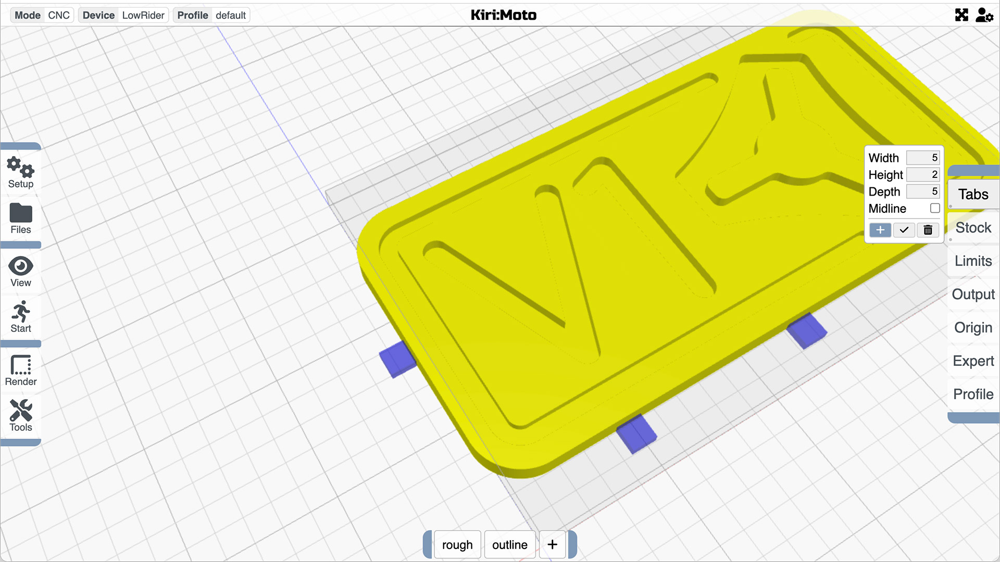{: loading=lazy width="600"}

Go to the  **operations modifier** menu (on the right hand side) and click on the **tabs** item.

Set the tabs dimensions to taste (there’s a tool tip on every menu and these are no different), click the “+” sign and click on your model in the spots you want to place a tab.

 Just for fun, I’ve decided to taper the edges of the letters V1, to make them a little finer, and to give us an excuse to set up a tool change.   At the beginning of this document I may have suggested leaving out the “tool change” code for a later time, which is a shame, because that time has arrived.

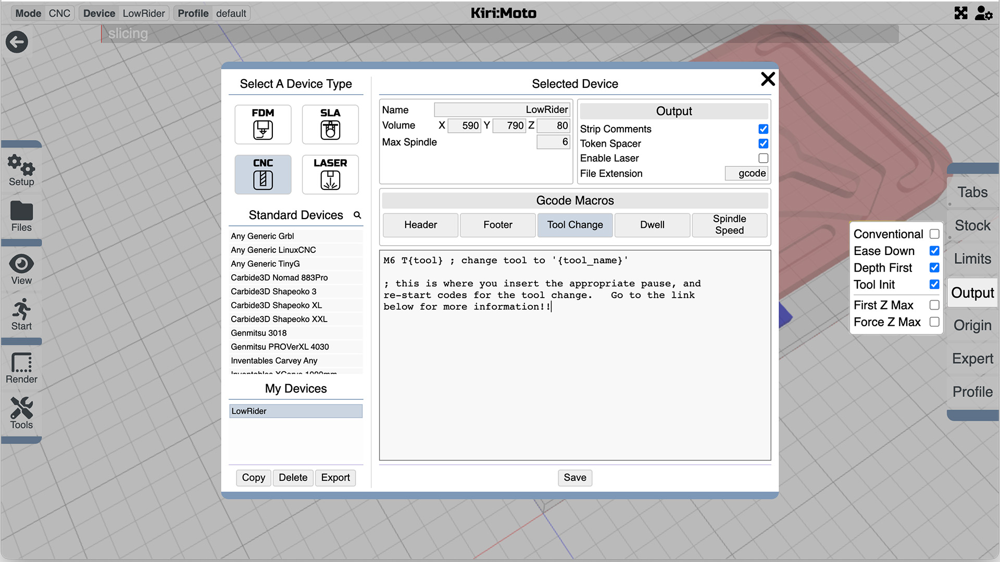{: loading=lazy width="600"}

Race back to the **setup** menu, select **Device>gcode macros> tool change**,  and cut and paste the code that best suits your machine from the "Milling Basics page, see [GCode Starting Ending and Tool Change. ](https://docs.v1engineering.com/tools/milling-basics/#gcode-start-tool-change-and-ending)

This will tell the machine to pause and do whatever machines do while you fiddle with the tool change and to start again where it left off when you tell it to do so.

Curiously (or not) you can skip that bit if you download the gcode as a zipfile.  When you unbundle the file each operation will appear as a separately titled bit of code so you can manually simply start each in your own time.   The gcode link will give you all of the operations in one bundle of code.

While that’s sinking in, whizz back to the **Output** menu and check that the **Tool Init** box is checked, unless you have an automatic tool changer, in which case it should not be checked, but if you have a tool changer, you probably aren't reading this beginner's guide! 

With that done, let’s get back to our the operations menu at the bottom of the page and unnecessarily over-complicate things in the interest of science.

Add *four* **pocket** operations and an **outline**. 

If we change our mind about how we want things to work, we have the ability to select individual parts of the project as separate operations, and we can experiment and rearrange the order of those operations simply by sliding the tabs on the bottom of the screen into a different order.   

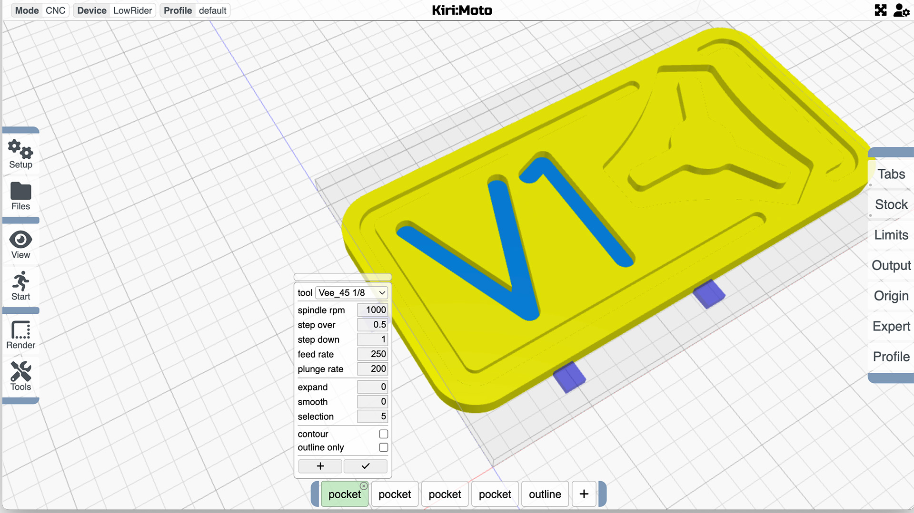{: loading=lazy width="600"}

In the image above, I have clicked the **+** button and added the face of the lettering as my first operation.  I’ve decided to use a V bit for that operation and am happy that it will cut within the outline of the letters.  When this operation has been completed Kiri:Moto will know there is a tool change required and pull our code snippet in where it's needed.

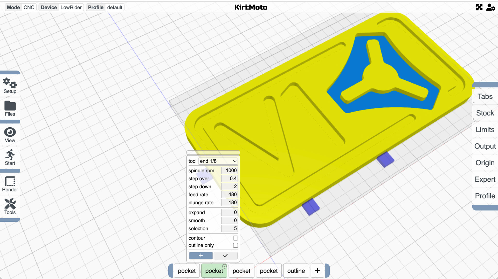{: loading=lazy width="600"}

Next, for demonstration purposes, I’ve decided I want the logo cut second, so again I’ve opened the next pocket operation and selected just the logo, and I've selected an end mill for this work, requiring that tool change.

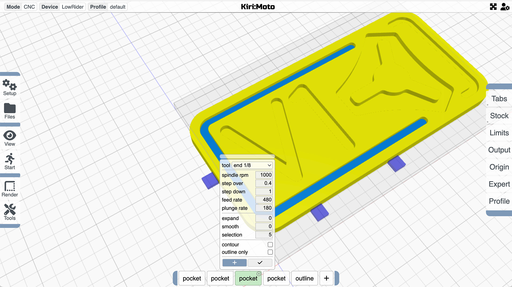{: loading=lazy width="600"}

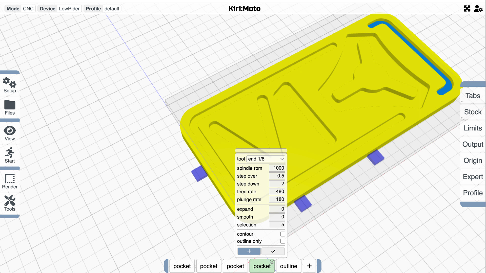{: loading=lazy width="600"}

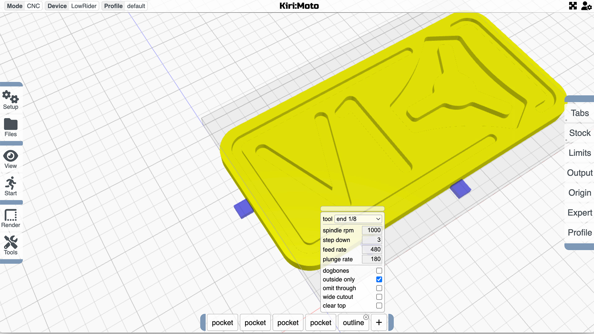{: loading=lazy width="600"}

... and so on until the only thing left to do is cut the outline.  For this, quite logically I’ve selected the outline operation and checked “outside only” to ensure the machine doesn’t go over all the work already complete..

All that’s left to do is to slice, preview and export, and it’s ready to run and cut what turned out to be a neat little practice example.

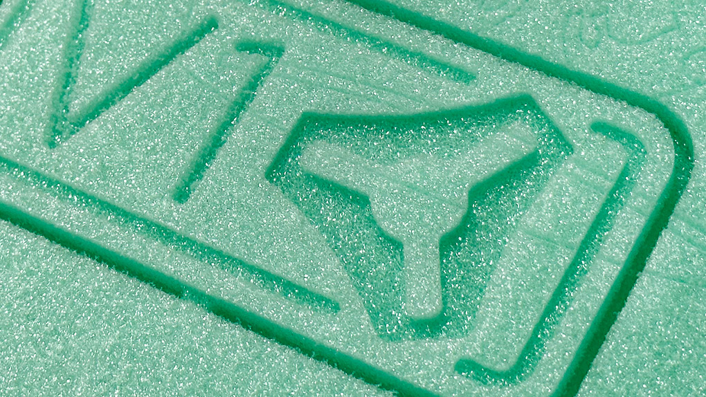{: loading=lazy width="600"}

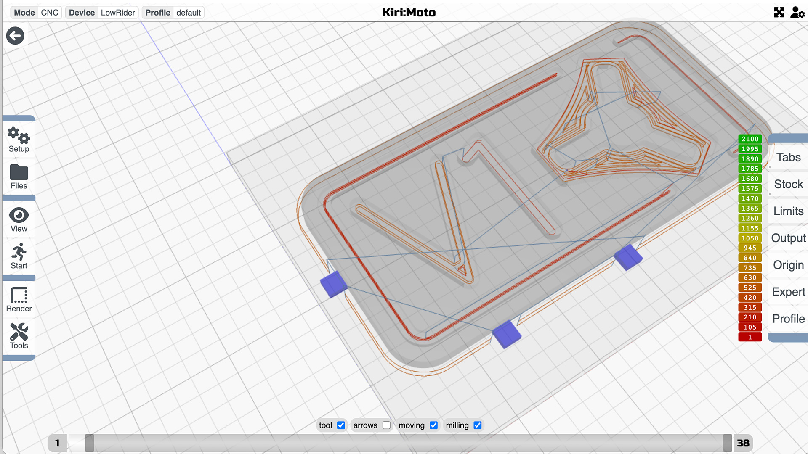{: loading=lazy width="600"}

