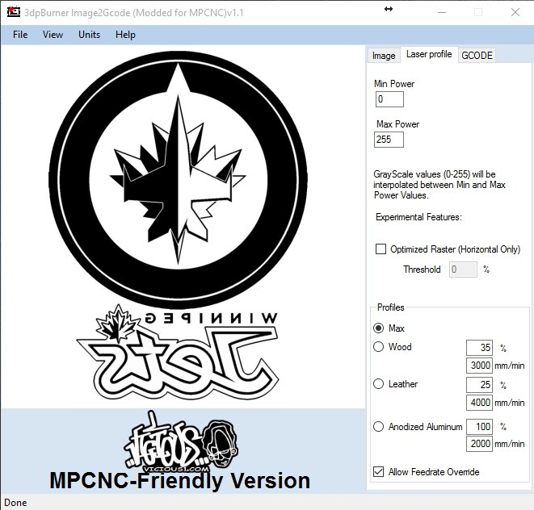

# Instruction STUB

## Laser Engraving Mirrors

Original by Jason | Nov 17, 2016 | Hardware & Electronics, Software

### Choosing an Image

Grey scale images do not translate well on to mirrors because either the surface is reflective or it
is not. So straight 2 color images with no gradients are best. Just plain old black and white. The
higher the resolution the sharper the edges.

### Resize and adjust

Next is open the image in Photoshop (or any image editor Paint.net is a free alternative), then
resize it match the size you need. It is best to set the pixel resolution in your image editor as
well. I use 100 px/cm or 0.1mm. I find the best quality with my setup at that resolution. Typically,
a higher resolution is recommended but I had unsatisfactory results. While in your editor you can
also adjust your levels to make the whites as white as possible and the blacks as black as possible.

### Image2GCode

After you have your image sized and ready to go open up
[Image2GCode](https://www.v1engineering.com/forum/topic/image2gcode-free-raster-image-laser-engraving-software-modified-for-mpcnc/)
and load your image. The linked version has been modified for the Mostly Printed CNC.

Remember you are engraving the backside of the mirror so you have to flip your image horizontally so
it appears the correct way on the front of the mirror. If you do not, it will be backwards and you
will need to start over.


You can also Turn the gamma way down too this will help darken the blacks more if need be. You want
the laser blasting as strongly as possible on the mirror.

Next on the Laser profile tab you want to leave Min Power at `0` and change Max Power to `255` or
select the Max radio button. No other changes required to the defaults here.



On the last and final GCODE tab there are a few changes I make here. In the Gcode header section I
add the following code:

```
G0 X0 Y0
M201 X1000 Y1000
M204 P1000 T1000
```

This code turns up the default MPCNC acceleration. You may need to tweak these settings for your
machine, these work well for mine.

Your feedrate may vary slightly depending on the finish of the mirror. A good starting point would
be 1200 mm/min. Click the Use `S` Param radio button. Type `106 S`in the Laser Power on MCODE box
and type `M107` in the Laser Power Off MCODE box.

I like to use diagonal scanning for best quality. You can choose to engrave an edge line if you
like or not by selecting the check box. Click Generate file, give your file a name and the GCODE
will be output.


### G Code Sender

Before running your file you should have already focused your laser to the height of the mirror
surface.

Now you can either load the G code onto an SD card and run it from your lcd or open Repetier Host.
In repetier click -File, -Load then find your file. Setting your laser to the `0,0` point on your
mirror and click print. Several hours later you should end up with something that resembles your
file like this.

{: loading=lazy width="400"}

(Sorry I did not have a picture handy of the exact file I used in this example.)

Feel free to ask questions [here](https://www.v1engineering.com/forum/topic/engraved-mirror-logos/).

**Check out all the work we do @ [banjags3dprinting](https://www.facebook.com/banjags3dprinting/)**
