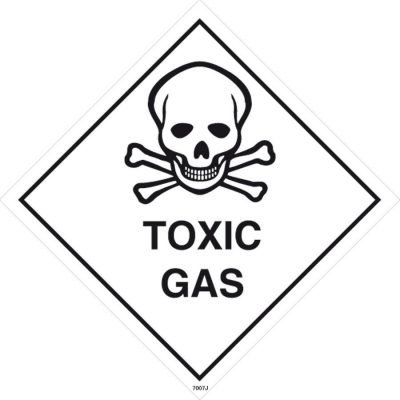
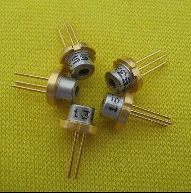
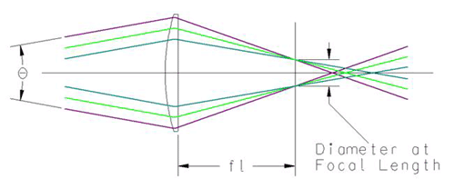
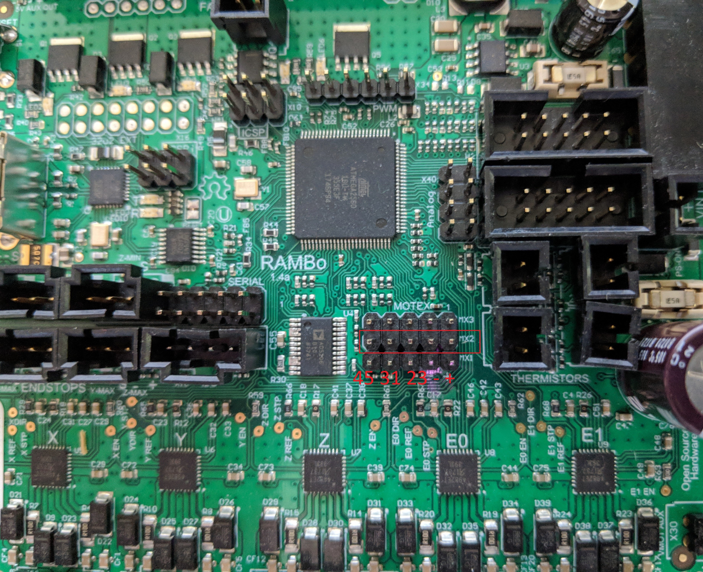
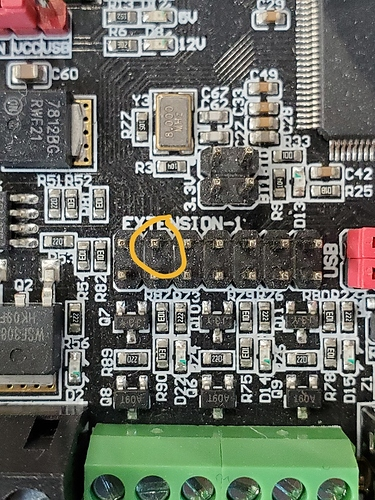
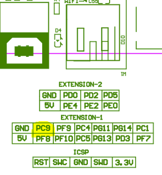
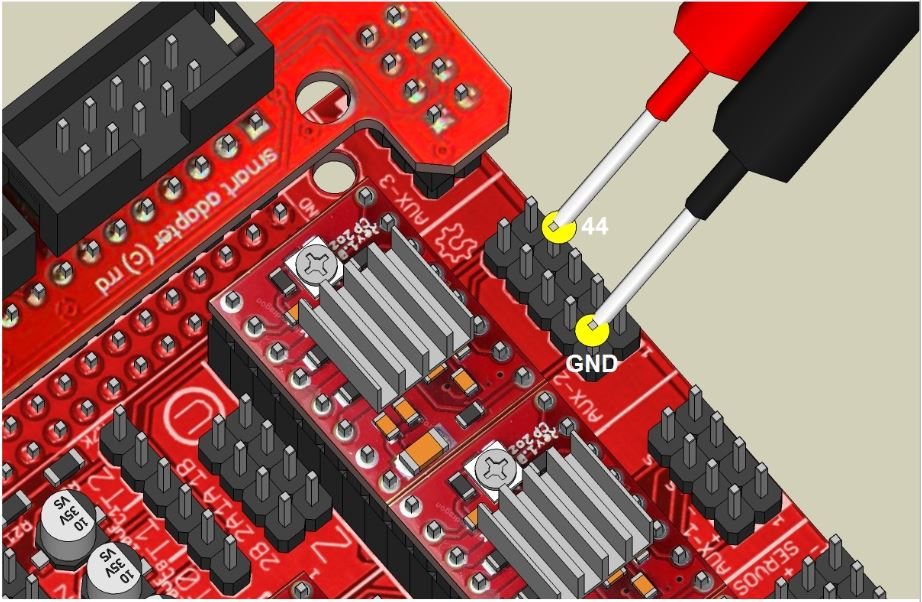

# Lasers

## Safety

### Eyes

{: loading=lazy width="200"}

First and foremost, these really are dangerous, not like ripping the tag off your mattress. These
can and will blind and or burn you in less than
[1/100th](https://en.wikipedia.org/wiki/Laser_safety) of a second, It takes ten times that long to
even [react](https://en.wikipedia.org/wiki/Corneal_reflex) by blinking **if** it is in the visible
spectrum. Did I make my point yet?

Safety glasses are paramount. This is not the place to try and save money. You need a high quality
pair and anyone else that could be around it needs the same quality. The cheaper your laser is the
more money you will need to spend on the safety glasses. Import lasers are notorious for being
multiple wavelengths, over powered, and this makes them more dangerous. High quality lasers are of a known wavelength
and strength therefore they are easy to protect yourself from. Import lasers can contain other wavelengths
that the supplied goggles may or may not protect you from or be more powerful than your glasses are rated
for. Buying laser goggles from a quality supplier should cover a wider range of wavelengths and offer a high power rating.

While we are on the subject, the laser looks extremely harmless in the goggles, kids (and most
adults) will try to take off the glasses immediately so no youngsters (or tough guys) unless the
laser is fully enclosed behind a laser shield and you trust them to listen. In the glasses the laser
is just a bright dot but you can see in your periphery the entire room lights up. You never know
when the laser could hit something slightly reflective, your mount could fail, the gcode could cram
it into the surface and break your mount, your air assist could drop into and reflect the beam
sending send a death beam in any direction.

### Lungs & Skin

{: loading=lazy width="200"}

The other end of the safety spectrum is the material you are working with. You can’t just go etching
and cutting things willy nilly. Ever think you could make [chlorine
gas](https://en.wikipedia.org/wiki/Chlorine_gas_poisoning) or
[cyanide](https://www.cdc.gov/niosh/ershdb/emergencyresponsecard_29750038.html) in your own
house….now you can. Laser cutting vinyl or ABS plastic does just that. Two extremely common
materials. [Here is the list](http://atxhackerspace.org/wiki/Laser_Cutter_Materials) I refer to most
often, if you have a link to a better guide please let me know. Best practice is to contain all the
laser smoke and direct it through a filter and vent it outside, at the very least vent it outside.
You do not want to breath any of the smoke any modern man made material makes.

### Fire

{: loading=lazy width="100"}

Now this one might be a little bit of a surprise to some and obvious to others. Lasers are burning
your material, add air assist directly to the burn zone and strong ventilation fans and you end up
with the best recipe for fire ever. Pay close attention never leave it unattended and have the
appropriate type of fire suppression on hand. Fire is not extremely common on good cuts but if it
does happen it happens stupid fast with all that force fed oxygen.

---

## Basics

### Types

{: loading=lazy width="200"}

Two of the most common lasers in the maker world are CO2 and Diode lasers. Diode lasers are much
more compact, have self-contained interchangeable optics, and are an order of magnitude lower power
than a typical CO2 laser. More on the Power in a bit.  These lasers operate at different wavelengths
and this can have an effect of the type of material they are suitable for. Diode based lasers can
range in price from a few dollars up to a few hundred, and CO2 based lasers start at a few hundred
and go up from there. Both lasers have some sort of focal lens, but a CO2 laser also has a mirror
system to steer the beam before focus. Diodes can be cooled with a small fan, CO2 use water and
sometimes a chiller.

{: loading=lazy width="280"}

Typically on any of the V1 Engineering machines you would be using a diode based laser. If your goal
is to cut wood or plastic you should be looking at a CO2 laser. A Diode is best at marking/etching,
and is only capable of cutting light materials (foam, paper, plastic) and very thin wood.

### Power

Laser power, not as straight forward as you would think. Higher numbers in general mean thicker
materials can be cut, or etching can be done faster. Numbers are not everything! A laser has four
things to consider when talking about its power; wattage, spot size, focal length, spectrum.

Wattage
:   The overall power output of your laser (like a light bulb, energy per time). On most
non-laser specific machines we are limited by speed. Okay stick with me, just like strapping on a
chainsaw motor to the MPCNC stronger is not always better. Since we can only move so fast before we
start to get motion degradation you need to size your laser accordingly. A strong laser moving
slowly will have an extremely limited range of  grey levels. For example at the same speed a higher
powered laser will have to use power 1-20 so you don’t start a fire (19 levels of grey), but a lower
powered laser will be able to use power 1-255 (254 levels of grey) without starting a fire. Make
sense?

Spot size
:   How small of a spot the wattage is concentrated on. Spot size dictates the resolution of
the image you can produce, think printer DPI (dots per inch). Another side effect of spot size can
be ability to cut. A poorly focused laser’s power is too spread out to be effective, a finely
focused laser cuts significantly better. For a diode this can vary 100-400 micron in diameter just
by laser wattage. To be more clear, more powerful diode lasers cannot be focused to as small of a
point as lower powered lasers (the source is not truly a point, larger diodes equal larger initial
“points”, and it is not actually a spot but a rectangular spot).

Focal length
{: loading=lazy width="400"}
:   This influences the shape of the laser cone (long and narrow or short and fat). The
focal length is dependent on the lens you use and should be a small range depending on the lens. If
you have a choice; a longer focal length can aid in cutting ability (a thinner steeper beam/cone can
cut deeper before power is lost to the edges of the material).

Spectrum
:   The wavelength of the light it produces (diodes-UV to viable, CO2- mid-infrared).
Materials react differently to every spectrum as do safety glasses. If you have a specific need do
your research before buying.

Duty cycle
:   One more thing on the topic of power, duty cycle or continuous time on. On the cheap
import look out for sensational things like “15W $50!” somewhere in the description it could say
“One second continuous operation time”. This means they are over driving the heck out of the laser,
it will not last long, and at 1 second bursts it is not very useful. Guard your wallet from these
Scammy Chumps. I just found another ad that says no more than 30min continuous, that might sound
like a lot at first but you can do some really detailed things that take a few hours.

### Air Assist

To get cleaner etching, deeper cuts, and to save your lens you need some sort of air assist. While
using your laser your material will produce smoke. This smoke if not directed away will stick to the
material you are working with producing a sooty poor looking cut or etching. This smoke will also
stick to the laser’s lens and very quickly build up heat before you know it the lens will break.
Bare minimum you need to have a
[40mm](https://shop.v1engineering.com/collections/miscellaneous/products/fan) fan clearing the area,
even better are
[radial](https://shop.v1engineering.com/collections/miscellaneous/products/radial-fan) fans (higher
pressure more direct), or even better yet a [small compressor](https://amzn.to/2SBnbkg). If you have
the ability to hook up your compressor and aim the air stream you can get significantly better cuts
this way. Once again don’t forget to vent your fumes safely and accordingly.

---

## The Hard Part

### Choosing

{: loading=lazy width="300"}

Choosing which laser to buy can be the hardest part.

If this all already seems overwhelming just buy a [JTechPhotonics
kit](https://jtechphotonics.com/?product_cat=laser-and-driver-combo-kits).
Why; it is a trusted laser/company, glasses proven suitable for it, complete kits available, the
only kit that is [US
legal](https://www.fda.gov/Radiation-EmittingProducts/RadiationEmittingProductsandProcedures/HomeBusinessandEntertainment/LaserProductsandInstruments/default.htm),
and the connections and use are as simple as it gets (more later). I think the 2W kits are a great
deal. If you have other companies to suggest please let me know, and I will check them out.

### PWM, TTL, WTF?

PWM, and TTL in this context are just how the power of the laser is controlled. All we really care
about is if the laser is controlled by 3.3V, 5V, or 12V. Good brands and companies make this abundantly
clear, if you are buying an import this is by far the hardest part of the whole thing. The specs are
not clear, the wiring diagrams are typically non-existent and if they are they can be wrong, we even
have drivers with PCB’s with misprinted polarity so you can’t even follow that. Unfortunately import
lasers, while super cheap, tend to be a guess and check game, both with connections and lens specs.

With all common boards we can handle 12V, 3.3V or 5V signals, no big deal!

**12V** signal driven lasers are less common (Jtech). They are simple, you plug them into the print fan
port (or any 12V port) on your control board and you are good to go. Using a 12V port you will
need to redefine the laser pin in the firmware.

**3.3 & 5V** driven lasers have the PWM/TTL pin defined in the V1 firmware as listed below. No edits should be 
needed. Your laser control pin needs to get plugged into this pin. Some lasers also have a TTL/PWM wire, that 
can get plugged into a nearby ground.

---

**Rambo**
Rated capacity = 10V-24V
PWM Pin = 45
:   {: loading=lazy width="400"}

---

**SKR Pro**
Rated Capacity = 12V-24V
PWM Pin = pc9

:   {: loading=lazy width="400"}
:   {: loading=lazy width="400"}

---

**Mini Rambo**  
Rated Capacity = 10V-28V  
PWM Pin = Currently a conflict with the LCD  
Trying to redefine it as pin 23, (Zmax Signal).  

---

**Ramps**
Rated Capacity = 12V
PWM Pin = 44
:   {: loading=lazy width="400"}

---

## Power Supply

Lasers need more power than the CNC does to run. You can not run your laser from the power supply included in the CNC kit. 
Typically your laser will come with it's own power supply though. If your laser power supply is within your control boards 
rated capacity you can simply swap them out. You can then use the control boards power terminals to connect the laser's 
power input pins.

### Using your laser

When Using our Marlin firmware You will need to use "inline" power mode in your laser software.

Your starting Gcode will also need to include "M3 I".

## Software

This is how to turn your ideas into laser commands. There are two modes to understand, Vector and Raster. Vector is moving 
with the laser power relatively constant. This looks like tracing an outline, or cutting material. Raster is when you are 
trying to make a grey scale image while the laser moves it is constantly varying the power to achieve different levels of 
grey / burn, or etching.

**Limitations** - Vector files can be run at much faster feedrates, basically as fast as you can move your machine before you 
get ringing or poor line quality. Raster on the other hand sends so many commands to the boards they have to run slower to 
process them. Doing raster images with the Marlin Firmware you are maxed out at about **22mm/s** before you start to see 
degradation (some very basic images can be ran faster).

### Lightburn

[Lightburn](https://lightburnsoftware.com/) is currently the best laser offering out there. Very easy to use and the most fully featured. Lightburn can generate your laser Gcode as well as control and 
run your machine if you would like. There is a free trial if you want to try before you buy.

Lightburn has several versions of focus and raster test programs built in as well.

### Free Software to try

[Image2Gcode](https://www.thingiverse.com/thing:2726163) – [Forum link](https://www.v1engineering.com/forum/topic/image2gcode-free-raster-image-laser-engraving-software-modified-for-mpcnc/page/11/#post-78280)

Vector based, Solid lines

[Inkscape Plug-In –](https://jtechphotonics.com/?page_id=2012)

[dxf2gcode](https://sourceforge.net/projects/dxf2gcode/) – [Forum link](https://www.v1engineering.com/forum/topic/dxf2gcode-a-quick-simple-open-source-app-for-vectordxfpdf-laser-engraving/)

## Galleries

Have a look at the galleries to see some of the ways people use lasers on the V1 CNC's. 
[LowRider CNC](https://forum.v1engineering.com/tag/gallery-lowrider-cnc) 
[MPCNC](https://forum.v1engineering.com/tag/gallery-mpcnc) 

