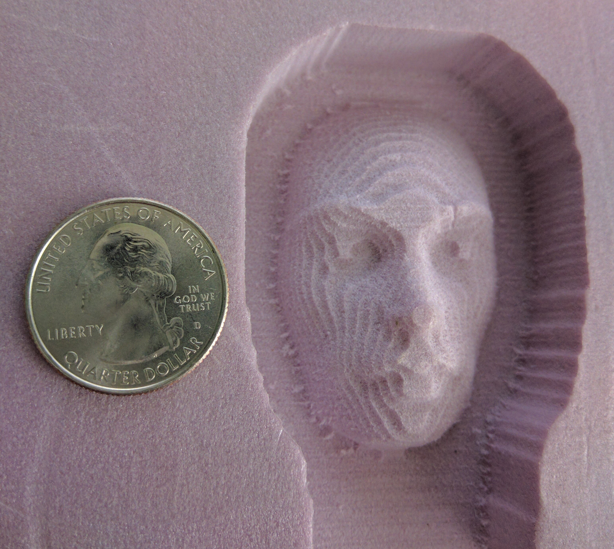
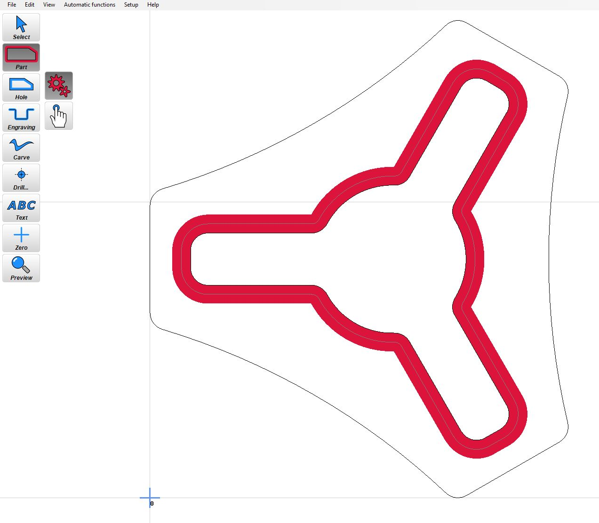
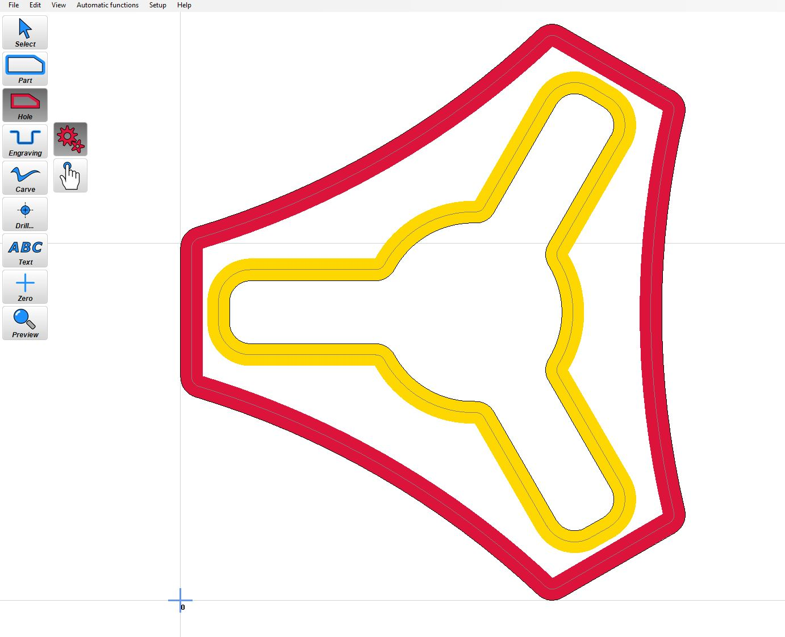
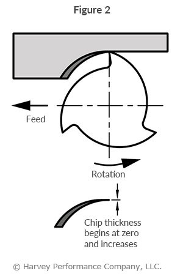
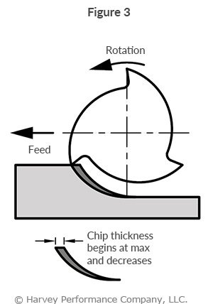
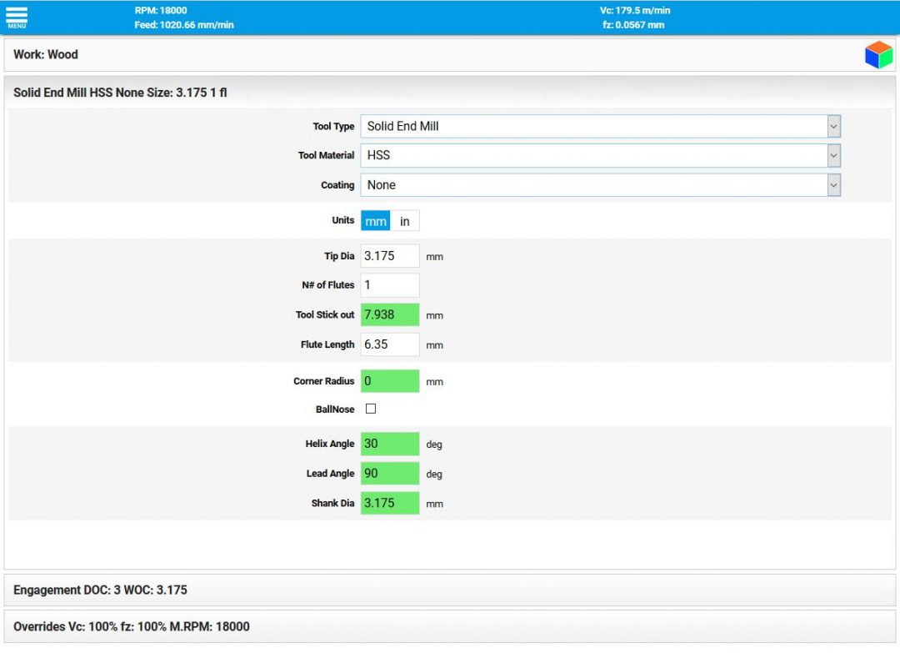
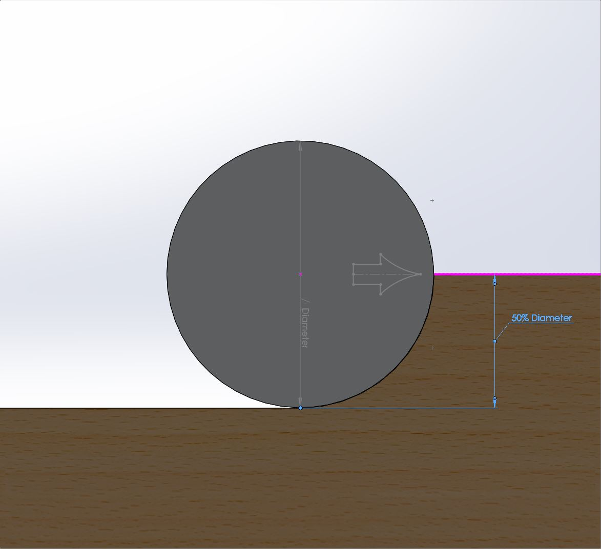
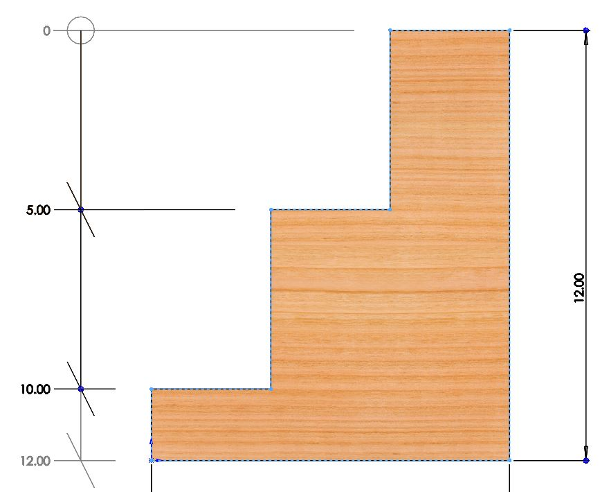
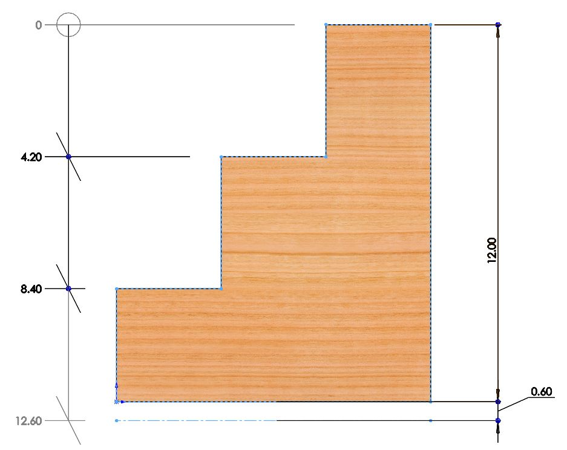
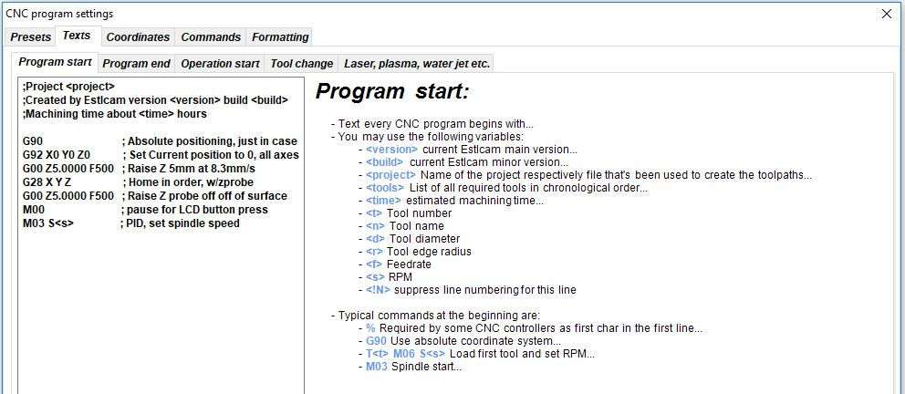

# Milling Basics

## Before You Do Anything

The basics for milling are not, well, basic. This subject can get very deep and intimidating so I will
try and present this in a tiered manner. Improving as we learn collectively and as the software
(CAM) improves. I am no expert. I learn by reading and trial and error.

Test cuts speak volumes and should be considered a requirement. You should have test cuts that are
small but representative of your part. If you are doing a 3D sculpt isolate a small part and mill it
out, if you are cutting out a part with a pocket and some holes make a small part with a pocket and
a hole. These test cuts can save hours on the actual job, every time you do one I promise you will
learn something.

---

## Baby Steps

You should have already done some plotting, as [shown
here](https://docs.v1engineering.com/software/estlcam-basics/). You should have a very clean drawing if you
don’t you should not be milling yet. Make sure the pen picks up all the way (clearance plane), and
**the parts are the right size**. This ensure your machine works correctly and you are familiar with the
basics of CAM and how your machine moves.

After plotting the next step in milling would be [HD foam](https://amzn.to/2fCJIvs), (I find it at
the big box store “foamular” $5 for a 1/4 sheet), this material holds amazing tolerances, mills very
well, and will not destroy your machine when you make a mistake. If you are new this should always
be the material you make a first test cut in, then on to test cuts in the material you want to use.
You can make test cuts on both sides and the $5 it costs will pay for itself many times over in
saved bits and refined CAM settings (time & accuracy).

{: loading=lazy width="400"}

Some of the first cuts ever made on an MPCNC.

## For The Impatient

If you just want to get the machine dirty here is the generic recipe. This should work in every material softer than metal; you can optimize later.

- **Single flute 1/8″** [upcut bit](https://www.v1e.com/collections/sharp-stuff/products/1-8-single-flute).
- 8mm/s **Feed Rate** (The speed at which you move through the material).
- 3mm/s **Plunge Rate** (The speed at which you move vertically into the material).
- 1mm **Depth of Cut** (The thickness of material your bit will be removing per pass).
- 45% **Step Over** (The percentage of bit diameter that should be in contact with the material)
- Use the **Peel** pocketing strategy.
- **Always** use a finishing pass of ≈10% of your tools diameter. The denser the material the smaller the finishing pass.

At this point you should be in HD foam, if that works out you can try some soft wood like pine.

If that works at this point **the only variable you should be changing is the depth of cut**. You can
vary this and it will increase the load on your machine in trade for more material removed per pass
or decrease the load by taking shallower bites.

Peel, Is usually the best pocketing strategy.

When you get that working and want to cut faster come back and learn things a little more in depth.

## A More Proper Introduction

These are some of the first things you should understand when just getting started. I am going to
collect and link all the great resources I think illustrate the point the best. Most of these
pictures should link to an outside site for more information. If you disagree with any of the
following information please let me know…politely.

### Islands

An island is that pesky little thing in the center of a cut, like the middle on an “O”, or the center of the logo. Super easy only takes 3 steps.

Using the **Part** tool select the inner feature.
:   {: loading=lazy width="200"}

Next is the **Hole** tool, select the outer feature.
:   {: loading=lazy width="200"}

Then in the Properties box select **Island**.
:   {: loading=lazy width="200"}

### Work offsets

A work offset is simply moving your origin. This is typically used when there are more than one
operation in your job, multiple fixtures can be used, locating pins, or other locating methods. More
typically for us to avoid Negative X and Y moves when using endstops.

Not Offset - Notice the Blue origin point in the lower left of the picture and how the red cut paths cross over the lines extending from it. These will be negative XY moves. If you have endstops negative XY moves will not happen.
:   {: loading=lazy width="200"}

Offset (Good for Dual Endstops)
:   {: loading=lazy width="200"}

### Finishing Pass

A finishing pass allows you to complete your job faster with more accuracy. What?!

By leaving a bit of material on your roughing cut you can then cut off a very small amount of material leaving you with a very accurate final cut with a better surface finish. This means you can rough out your part faster (high machine loads increase deflection) and the finishing skim cut (extremely low machine loads) will bring it to final dimension. **All** cuts should have this, most importantly slotting operations.

- Just select your finishing tool, usually the current tool you are using. Shown in the yellow box.
- Use a 5-25% tool diameter allowance. Shown in the yellow box.
- The finishing pass is show in the picture as the lighter red path.

{: loading=lazy width="200"}

### Climb vs. Conventional Milling

For the most part you always want to Climb mill. The edge of the cutter starts with a large bite and ends small, reducing deflection, work hardening, and heat retention.

!!! note "Conventional milling"
    [{: loading=lazy width="200"}]( http://www.harveyperformance.com/in-the-loupe/conventional-vs-climb-milling/)

!!! note "Climb milling"
    [{: loading=lazy width="200"}](http://www.harveyperformance.com/in-the-loupe/conventional-vs-climb-milling/)

### Feeds and Speeds Calculator

I cannot stress this enough; these numbers are different for every build. Use them as a guide
to find the right settings for your build. You can make a few test cuts a quickly work out how to
get reliable numbers for your machine. If you keep track of the chip load and cutting force for your machine setting up new jobs gets easier by just matching the numbers for that material.

https://fswizard.com/www/

{: loading=lazy width="400"}

### Stepover

Stepover is the amount of material your tool encounters in percentage of your tool diameter. The lower the percentage the lower the force on the machine, the more accurate the cut. Too small though and it will just rub.

**Roughing** is when you are taking out as much material as possible sacrificing tolerances and surface finish.  Your stepover while roughing is 95% or less, I recommend 45% depending on material density. More than 50% you will be both climb and conventional milling and should be avoided unless you know your machine can handle it.

**Finishing** is 20% or less stepover depending on amount if detail and tolerances desired. The more aggressive your roughing pass the more material needs to be left for finishing. For wood and plastic 10-15% tool diameter is a good starting point, 3D milling and carves should use 2-10% depending on tool diameter and desired surface finish.

!!! note "50% stepover"
    {: loading=lazy width="200"}

!!! note "25% stepover"
    {: loading=lazy width="200"}

### Depth of Cut

Equal steps – Depth of cut, DOC, Should be planned for. Making equal steps will produce the fastest cuts. Know the deepest you can cut the material with your machine (remember those test cuts from earlier?) and from there divide the cut equally.

!!! note "Equal Steps"
    {: loading=lazy width="400"}

!!! note "Unequal Steps - This can be used to improve a pockets surface finish"
    {: loading=lazy width="400"}

**Through all** – Through all cuts are intended to go all the way through the material. They should move past the bottom of your material. The amount past depends on the flatness of your build, all build have some sort of variance. A 0.5mm-4mm over cut would be pretty typical. Factor this into your equal DOC from above.

!!! note "Through All"
    {: loading=lazy width="400"}

## Gcode - Start, Tool Change, and Ending

### Starting Gcode

What your machine will do **before** the job starts. The LowRider Configs show examples of how an IOT relay would be tied in. You would use something similar to [this](https://amzn.to/3vjqzFH) to turn a router, vacuum, or other things on and off with Gcode.

=== "MPCNC - Marlin" 
    On the MPCNC you will typically home the XY axes before starting your job and drive the machine with the control panel to the starting position. This gcode would then run to reset the coordinates and probe the surface.
    ```
    G92 X0 Y0 Z0 ; Set Current position to 0, all axes
    G00 Z5.0000 F500 ; Raise Z 5mm at 8.3mm/s to clear clamps and screws
    G28 X Y Z ; Home in order, with Z touchplate
    G92 Z0.5 ; Account for probe thickness (set your thickness)
    G00 Z5.000 F500 ; Raise Z probe off of surface
    M00 ; Pause for LCD button press so you can remove the touchplate
    ```

=== "MPCNC - GRBL/Jackpot" 
    On the MPCNC you will typically home the XY axes before starting your job and drive the machine with the control panel to the starting position. This gcode would then run to reset the coordinates and probe the surface.
    ```
    G21
    G90
    G94
    G92 X0 Y0
    M0 (MSG Attach probe)
    G38.2 Z-80 F200 P0.5 (probe down set thickness )
    G1 Z10 F900
    M0 (MSG Remove probe)
    M62 P1 (If used start spindle pin27 )
    ```    

=== "LowRider V3 - Marlin" 
    On the Lowrider V3 you will typically home all axes before starting your job and drive the machine with the control panel to the starting position. This gcode would then run to reset the coordinates and probe the surface.
    ```
    G92 X0 Y0 ; Set Current position to 0 on the X and Y axes.
    M0 Attach probe ; Pause to connect touchplate
    G38.2 Z0 ; Probe down to touchplate
    G92 Z0.5 ; Set new Z position to thickness of touchplate
    G1 Z2 F900 ; Lift off touchplate
    M0 Remove probe ; Pause and wait for touchplate removal
    M106 ; This will turn on an IOT relay to start a router or vacuum
    ```

=== "Lowrider V3 - GRBL/Jackpot"
    On the Lowrider V3 you will typically home all axes before starting your job and drive the machine with the control panel to the starting position. This gcode would then run to reset the coordinates and probe the surface.
    ```
    G21
    G90
    G94
    G92 X0 Y0
    M0 (MSG Attach probe)
    G38.2 Z-80 F200 P0.5 (probe down set thickness )
    G1 Z10 F900
    M0 (MSG Remove probe)
    M62 P1 (If used start spindle pin27 )
    ```

### Tool Change


Only happens if you change a tool during your job. It happens at each tool change if there are multiple.

=== "MPCNC - Marlin" 
    ```
    G0 Z35 F500 ; Raise Z axis 35mm make sure you have enough room
    M00 ; Pause and wait for the tool change
    G28 Z ; Home the Z axis to establish the new Z position
    G92 Z0.5 ; Account for probe thickness (set your thickness)
    G00 Z5.0000 F500 ; Lift off touchplate
    M00 ; Pause to remove the touchplate
    ```

=== "MPCNC - GRBL/Jackpot" 
    ```
    M63 P1 (turn off pin 27)
    G91
    G0 Z10
    G90
    G0 X0 Y10 F2520 
    M0 (MSG change tool, probe)
    G38.2 Z-80 F200 P0.5 (Probe set thickness)
    G00 Z10.0000 F500 (Clearance)
    M0 (MSG remove probe)
    M62 P1 (turn on pin27)
    ```

=== "LowRider V3 - Marlin" 
    ```
    M107 ; Turn fan 1 off IOT relay
    G28 Z ; Raise Z axis
    G0 X0 Y0 F2520 ; Drive to tool change side
    M00 change tool, probe ; Pause to change tool and attach probe.
    G38.2 Z0 ; Probe to touchplate
    G92 Z0.5 ; Set Z to touchplate thickness
    G00 Z5.0000 F500 ; Lift off touchplate
    M00 remove probe ; Pause to remove touchplate
    M106 ; Turn fan 1 on IoT relay
    ```

=== "LowRider V3 - GRBL/Jackpot" 
    ```
    M63 P1 (turn off pin 27)
    $HZ (Home Z)
    G0 X0 Y10 F2520 
    M0 (MSG change tool, probe)
    G38.2 Z-80 F200 P0.5 (Probe set thickness)
    G00 Z10.0000 F500 (Clearance)
    M0 (MSG remove probe)
    M62 P1 (turn on pin27)
    ```

### Ending

Happens directly after your last move from your job file.

=== "MPCNC - Marlin"
    ```
    G0 Z5 ; Lift Z axis 5mm
    M00 ; Pause so the Z axis does not fall
    ```

=== "MPCNC - GRBL/Jackpot"
    ```
    M63 P1 (stop spindle pin27)
    G91
    G0 Z10
    G90
    M30
    ```

=== "LowRider V3 - Marlin"
    ```
    M107 ; Turn off IOT Relay
    G28 Z ; Lift Z axis
    M0 Diggidy Done! ; Pause to keep steppers energized
    ```

=== "LowRider V3 - GRBL/Jackpot"
    ```
    M63 P1 (stop spindle pin27)
    $HZ
    M30
    ```    

#### Estlcam Gcode
Here where the above snippets would go in EstlCAM. It would look similar in other programs.

{: loading=lazy width="400"}
{: loading=lazy width="400"}
{: loading=lazy width="400"}

## Post Processors

When making Gcode with your CAM program it outputs raw coordinates, speeds, and a few other
commands. A post processor (PP) simply formats in a way that your firmware will recognize.

All machines require a post processor, specific to the control board firmware.

### The ones we have working

Please share your links to other post processors. I know there are more.

#### Estlcam
:   Built in, Christian was happy to work with us to get this correct. [Here are the recommended
settings](../software/estlcam-basics.md)

#### Fusion360:

!!! warning
    Fusion's free plan no longer supports more than one speed, so the feedrate for XY turn into very
    fast Z movements. More details in the forum
    [here](https://forum.v1engineering.com/t/problem-with-fusion-and-z-feedrate/21487).
    
    Using Guffy's v2.0 or the Flyfisher604 PP with scaling enabled can help resolve this issue. 

##### Guffy Fusion360 Post Processor

Guffy has really made what seems to be a feature complete PP here, [Guffy’s
GitHub](https://github.com/guffy1234/mpcnc_posts_processor). [Fusion CAM
intro](https://www.youtube.com/watch?v=Do_C_NLH5sw).

##### FlyFisher604 Fusion360 Post Processor

Flyfisher604 has created a Post Processor ([Flyfisher604's
GitHub](https://github.com/flyfisher604/mpcnc_post_processor)) based on Guffy's PP. The Flyfisher604
post processor addresses the issues introduced by the F360 Hobby version. This includes:

- Scaling of feed rates to resolve MPCNC's max Z feedrate being less then XY max cut rate
- Recovery of the G0 Rapid that moves to the starting location of the cut
- Recovery of G0 Rapids that occur at a safe level above the work

#### Vectric, Aspire, Vcarve
:   What we have so far, [Here](https://forum.v1e.com/t/z-slip-over-large-topographical-map/6905#post-51193). How to [install](https://forum.v1e.com/t/vectric-aspire/12047/8?u=vicious1).

#### Kiri:Moto

Kiri:Moto has the post processor built in for Marlin and GRBL.
Our instruction page is [here](../software/kiri.md).

## Endmill Basics

To Do
