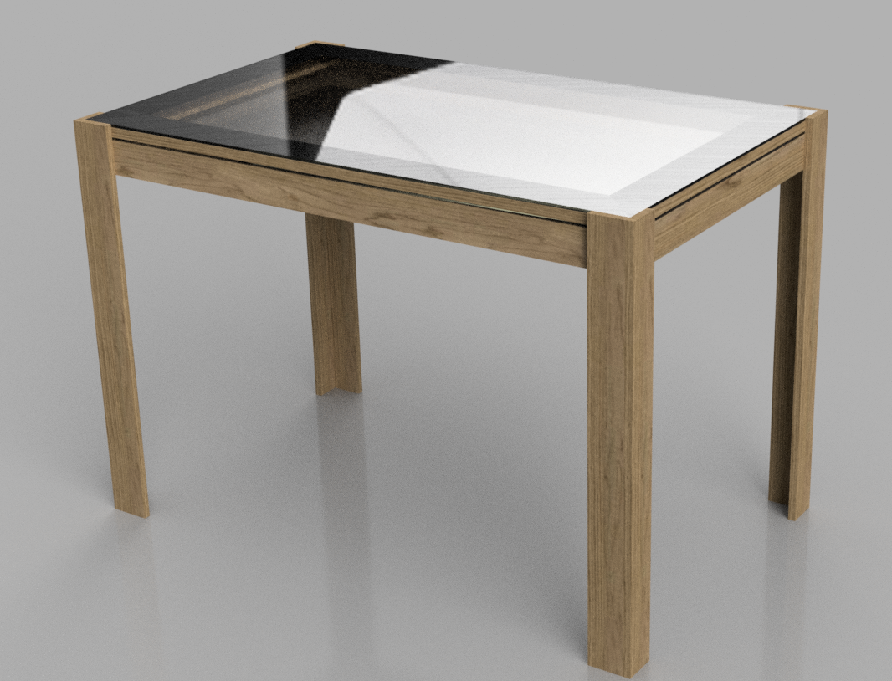

# ZenXY v2

{: width="450"}

Inspired by the awesome Sisyphus Table by Bruce Shapiro, [http://www.sisyphus-industries.com/](http://www.sisyphus-industries.com/), Zen gardens that my mom loves, and the crazy CoreXY belting system.

This is my second attempt at an automated Zen Garden (or whatever you might call it).

{: width="450"}

[Rendered Animation](https://youtu.be/LmXAHtwVOIo)

## Pattern Software

**Sandify**
{: width="450"}

Amazing patterns are easily possible by using [Sandify.org](https://sandify.org/), the back end is here [Sandify on GitHub](https://github.com/jeffeb3/sandify),
This table would be nothing without this tool! ([feel free to show some appreciation for this amazing free piece of
software](https://liberapay.com/jeffeb3/)).

**Karl’s EstlEgg-ify**
Karl’s way allows for some custom vector graphics to be easily drawn. Here in the [Forum](https://www.v1engineering.com/forum/topic/artistic-designs-with-inkscape-eggbot-tools-and-estlcam/).

## Bill of Materials

**Full kits will be available in the shop soon.**

___

| Printed Parts     | QTY. |
|-------------------|------|
| Truck 1A          | 1    |
| Truck 1B          | 1    |
| Truck 2A          | 1    |
| Truck 2B          | 1    |
| Power Corner Main | 1    |
| Power Corner 2    | 1    |
| Cross Corner 1A   | 1    |
| Cross Corner 1B   | 1    |
| Cross Corner 2A   | 1    |
| Cross Corner 2B   | 1    |
| Zen Center        | 1    |
| Tension Block     | 1    |
| Trigger           | 1    |

**Spacers**

The spacers are optional and only needed if your glass mounting hardware protrudes. The STL files are 1mm thick and can easily be scaled in the Z direction only up to about 7mm before the 12.7mm magnet might start to pose an issue. If needed, one magnet spacer and two of each corner spacer are used, all scaled to the same Z dimension.

If you glass is not mounted planer to your corners you can use a ssecond magnet and stack them to reach your glass.

Insert Picture of mounted glass

**Printing Recommendations** 

Most any semi-rigid material will work for printing these parts. PLA or PETG are highly recommended for accuracy, durability, and overall ease of use. 25% infill. **No support should be needed for any part I have designed.**

| Files can be found at                             |                                                               |                                                     |
|---------------------------------------------------|---------------------------------------------------------------|-----------------------------------------------------|
| [GitHub + Step Files](https://github.com/V1EngineeringInc/ZenXY-v2) | [PrusaPrinters](https://www.prusaprinters.org/prints/62780-zenxy-v2-1234) | [Thingiverse]() |

___

[Hardware & Components kits](https://shop.v1engineering.com/collections/zenxy/products/zenxy-v2-hardware-bundle) are available in the shop.

| Hardware                          | QTY. |
|-----------------------------------|------|
| M5 x 0.8 x 30mm Phillips Pan Head | 34   |
| M5 Locknut                        | 9    |
| M3 x 0.5 x 10mm Phillips Pan Head  | 6    |
| M2.5 x 12mm Phillips Pan Head     | 6    |
| Y Rail Larger Diameter [Calc](zen2calculator.md)     | 2    |
| X Rail Smaller Diameter [Calc](zen2calculator.md)    | 2    |

| Components                       | QTY. |
|----------------------------------|------|
| [½” x ½” Magnet](https://shop.v1engineering.com/collections/zenxy/products/1-2-x-1-2-magnet)                   | 1    |
| [½” Steel Ball](https://shop.v1engineering.com/collections/zenxy/products/1-2d-steel-ball)                   | 1    |
| [Mini V Wheel](https://shop.v1engineering.com/collections/zenxy/products/v-wheel)                    | 19   |
| [GT2 10mm 16 Tooth Pulley](https://shop.v1engineering.com/collections/zenxy/products/pulley-16-tooth-gt2-10mm)         | 2    |
| [GT2 10mm 20t Idler](https://shop.v1engineering.com/collections/zenxy/products/20t-idler-gt2-10mm)               | 8    |
| [GT2 10mm Belt](https://shop.v1engineering.com/collections/zenxy/products/gt2-10mm-belt)                    | [Calc](zen2calculator.md)    |
| [NEMA 17 Stepper 22mm shaft (min)](https://shop.v1engineering.com/collections/zenxy/products/nema-17-76oz-in-steppers) | 2    |
| [Optical Endstop](https://shop.v1engineering.com/collections/zenxy/products/optical-endstop)                  | 2    |

___

## Control Board

There are a lot of options.

Any board with two drivers or more with firmware capable of running CoreXY, and TMC silent stepper drivers are highly recommended.

**[TMC2209 Pen/Laser Controller](https://www.tindie.com/products/33366583/tmc2209-penlaser-controller/)** -  by Bart Dring, seems 
to be a perfect match for the Zen. This board has the silent 2209 drivers, and the esp32 has a built-in web interface for wireless
control and file transfer. You can sign in from any device that is within its WiFi range or add it to your own network for remote control.

## Firmware

This is running CoreXY belting and requires homing Y before X, as set in the firmware. All firmware will also need the exact size of your 
build to be input before compiling as well.

Here is a example Marlin firmware [Firmware link](https://github.com/Allted/Marlin/tree/CHOOSE_VERSION)

Here is an example TMC2209 Pen/Laser Controller firmware link needed

## Wiring

The stepper with the endstops on the same block gets plugged into the "X" port on the control board. If it does not move correctly, power 
down unplug and flip them both over, or flip just one over. It is more confusing then the regular Cartesian troubleshooting. Guess and check
seems to be the best way.

The Y endstop is triggered along the larger dimeter tube. The X is the other one :smile:.

## Example table

Pictures

{: width="450"}

Basic CAD file, [Fusion 360 version](https://a360.co/3wNh68T).

## Example Starting Gcode

This table uses hardmounted endstops and endstop triggers so you need to Home Y first and typically Add some off sets to get to the starting point just where you want it.

For GRBL you can use
$HY
G92 X0 Y0
G0 Y-18.5
G92 X0 Y0
$HX
G0 X-28
G92 X0 Y0
G1 X2 F2000

For Marlin it would be
G28 Y
G92 X0 Y0
G0 Y-18.5
G92 X0 Y0
G28 X
G0 X-28
G92 X0 Y0
G1 X2 F2000

Here is a Human readable version of that

Move the Y axis all the way to the Trigger.
Set the current location of X and Y to be Zero.
Move The Y axis in 18.5mm closer, past the flag.
Move the X axis until it triggers.
Move the X axis in 28mm Further past the flag.
Set the current location to Zero X and Zero Y.
Move out 2mm in the X axis direction at 2000mm/min (33mm/s). This is just incase you forget to set a speed in your Gcode, this assures the machine moves at a safe speed.

## License

[![CC BY-SA 4.0][cc-by-sa-shield]][cc-by-sa] 

This work is licensed under a
[Creative Commons Attribution-ShareAlike 4.0 International License][cc-by-sa].

[cc-by-sa]: http://creativecommons.org/licenses/by-sa/4.0/
[cc-by-sa-image]: https://licensebuttons.net/l/by-sa/4.0/88x31.png
[cc-by-sa-shield]: https://img.shields.io/badge/License-CC%20BY--SA%204.0-lightgrey.svg
